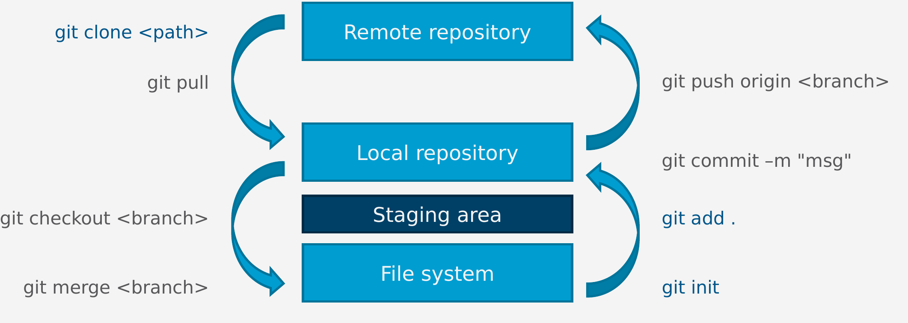

## Understanding Git

**Git** is a version control system (VCS) enabling collaborative work on source code. It is considered the standard
that every developer should know. It is also crucial to understand how Git is used for, e.g., project management since
it is fundamental to the way software is developed collaboratively.
If you are unfamiliar with Git, there are many online tutorials which will satisfy
your information needs to an arbitrary depth (see, for instance, [here](https://try.github.io/) or
[here](https://www.atlassian.com/git/tutorials), which have been used while writing this tutorial).
In this tutorial, only the most important Git facts and commands are explained in a condensed fashion.
For some of the subsequent statements there exist some intentional inaccuracies or exceptions. However, for this course,
the given information combined with some own research should be enough for you to be productive with Git.

### The basic structures in Git
Broadly speaking, Git enables developers to **clone**, that means "download", code from a **remote repository** into
the developer's **local repository** positioned on the developing machine. The developer then can apply changes
to the code which are then **push**ed back to the remote repository. Prominent hosts of remote repositories include [GitHub](https://github.com/)
and [GitLab](https://about.gitlab.com/). In this course, you are provided with a repository on [ZIV GitLab](https://zivgitlab.uni-muenster.de/).

Most often, the remote repository consists of different branches. These branches each represent the code base with different
changes applied to it. The **master** (sometimes also called **main**) branch is the default branch which is created during the initialization of a new
repository. The master branch can be thought of as the history of production-ready versions of the code.
For new features, development takes place on **development**, e.g., **feature branches**. If, for instance, a new functionality is added to the
code base, a new feature branch is created. While developing this feature one does not touch the code base on the master branch.
It might even be sensible to have further subbranches of a feature branch to develop subfeatures.
**The master branch should never contain an instable version of the source code**. (For instance, there never should be
security concerns due to some halfway-done feature.) Once the feature is stable and adequately tested, it is **merge**d into the
master branch, that means, the feature is added to the stable code base. Branches can also be created for other purposes such as
non-features like refactoring code. 

### (Opinionated) most important commands
While this has been an abstract discussion on what Git is used for, this section will explain some basic commands and their
meaning. All commands have various additional arguments which you can specify but which are omitted at this point.
If you are in a specific situation and the given commands are insufficient, you can consult the documentation (for example
[here](https://git-scm.com/docs)).

Broadly speaking, we differentiate between the file system, the staging area, the local repository, and the remote repository. 
The Git commands, as summarized in the image below, are mostly responsible for transferring file changes between these
different locations. The code on the remote repository can be accessed by different developers. The local repository, the
staging area, and the working space, i.e., the file system, are all located on the developer's machine.

The transferal of files can be best described by the different Git commands. They are executed using a console at the location
where your project is located.
You can also execute these commands via the GUI of the Eclipse Git integration (see [Eclipse Git integration](#egit)). 
However, for understanding the Eclipse Git integration, it is strongly advised to read about the functionality
of the subsequent commands.

In the following, in-code words written in <i>cursive</i> represent context-specific text. For instance <i>existing_feature_branch</i> represents the name of
an existing branch.

* <code>git init</code> initializes a new repository at the given position. You do not have to do this if you
  use <code>git clone</code> on an existing repository.
* <code>git clone</code> clones the given repository. You will have a local copy of all files in the repository. 
  Example: <code>git clone https://github.com/wwu-pi/adder-application </code>.
* <code>git checkout</code> switches between existing branches. If you currently have the master branch checked out (which is the default),
  and you check out a feature branch, the files in your local working directory (the files on your development machine)
  will change to the state of the feature branch. Example: <code>git checkout <i>existing_feature_branch</i></code>. New branches in the
  remote repository must first be <code>fetch</code>ed (see below).
* <code>git checkout -b</code> creates and checks out a new feature branch. If you currently have the master branch checked out, and
  you want to work on a new feature, you can create a new branch for this and immediately switch to this new branch. Your
  files will be the same as on the previous branch, but <code>push</code>-commands (see below) will target the new branch. Example: <code>git checkout -b <i>new_feature_branch</i></code>.
* <code>git add</code> adds the current version, i.e., the current **snapshot** of the chosen files to the staging area. Files that are not added to the staging area cannot be <code>commit</code>ted and later <code>push</code>ed (see below).
  Explicitly calling <code>git add</code> sometimes is not necessary (see <code>git commit</code>). 
  Example: <code>git add MissingClass.java</code>
* <code>git commit -m <i>commit message</i></code> applies the changes in the staged files to your local repository. All invocations of <code>git add</code> are bundled in one subsequent **commit**.
  The changes are commented with a message and show up in the commit history of the repository (as an example, see
  [here](https://github.com/Z3Prover/z3/commits/master)).
  This makes it easier to track down erroneous changes. As a shortcut, you can "skip" the explicit <code>git add</code>-call by
  executing <code>git commit -am <i>commit message</i></code>. This should only be done if you want to include all
  <i>tracked</i> files into the commit. Each file in the working directory is tracked or untracked. After cloning, all cloned files are tracked. If you wish to untrack a file, you must
  do so explicitly. You can also "skip" the explicit <code>git add</code>-call by specifying the files that should be commited
  in the commit call: <code>git commit <i>file0</i> <i>file1</i> ... -m <i>commit message</i></code>. Note that this only works if you 
  already track the files you want to commit. If this is not the case, <code>add</code> them first.
* <code>git diff</code> shows the difference between the two Git data sources. Example: <code>git diff</code> will show
  the difference between your current, uncommitted local changes and your committed changes.
* <code>git push</code> applies the changes which reside in your local repository to the remote repository. If you switched
  to a feature branch and have committed changes, the changes are only visible for you. After executing <code>git push</code>
  the changes are "uploaded" to the remote repository so that others might "download" them. If you wish to push a new branch, 
  which does not yet exist on the remote repository, use <code>git push -u origin <i>new_branch</i></code>, where <i>new_branch</i>
  is the name of the branch you want to push.
* <code>git pull</code> "downloads" the latest code base from the currently checked out branch. You should have committed all of
  your changes before attempting to pull changes from the remote repository.
  If someone changed the remote code and these changes are not yet in your code, <code>git pull</code> will try to merge the
  two versions automatically. (Under the hood, <code>git fetch</code> and <code>git merge</code> are executed by <code>git pull</code>.) If this does not succeed, a <i>merge conflict</i> is present which must be resolved manually.
  For this, the corresponding files must be edited. The merge conflict in the file is indicated by

  <code> <<<<<<< HEAD </code> <i>some code</i>
  <code> ======= </code> <i>some other code</i>
  <code> >>>>>>> other_version </code>

  The portion of code between <code> <<<<<<< HEAD </code> and <code> ======= </code> indicates one version of the two versions
  which caused a merge conflict. On the other hand, code between <code> ======= </code> and <code> >>>>>>> other_version </code>
  indicates the other version involved in the merge conflict. You have to manually decide on which changes are the correct ones,
  delete the indicators, and commit as well as push the changes. To commit a merge conflict-resolution, commit the conflicting files using 
  <code>git commit -i <i>file0</i> <i>file1</i> ... -m <i>commit message</i> </code>.
  To avoid merge conflicts it is useful to work on disjoint portions of the source code.
  
  Another scenario where it makes sense to pull changes is to add a feature to the master branch. If you currently have
  checked out the feature branch, you might want to execute <code>git checkout master</code> followed by <code>git pull origin
  <i>feature_branch</i></code>. You then will have to push the pulled changes to the remote repository.
* <code>git fetch</code> retrieves the most recent metadata from the specified repository. If, for instance, a colleague
  created and pushed a new branch which you too want to work on, you first might need to fetch the metainformation to see
  that this branch is available before executing <code>git checkout <i>new_feature_branch</i></code>.
* To push an existing repository to a new repository, a sequence of commands can be executed. First, clone the repository via
  <code>git clone <i>existing repository url</i></code>. Then, rename the remote origin to avoid conflicts via
  <code>git remote rename origin <i>some other name</i></code>. As the third step, add the new remote origin via
  <code>git remote add origin <i>repository-url.git</i></code>. Lastly, push the branches to the new repository via
  <code>git push -u origin --all</code>. Example: 
  
    <code>git clone https://github.com/wwu-pi/adder-application </code>
    
    <code>cd adder-application</code>

    <code>git remote rename origin old-origin</code>

    <code>git remote add origin https://zivgitlab.uni-muenster.de/yourUserName/my-adder-application </code>

    <code>git push -u origin --all </code>.
  
  
  

### The .gitignore file
In a repository there usually is a .gitignore file. In the .gitignore-file you can specify patterns and specific names
which should **not** be managed by Git. You can see an exemplary .gitignore-file [here](https://github.com/wwu-pi/adder-application/blob/master/.gitignore).
It usually only makes sense to exclude files that are specific for the developer at hand, such as specific configurations. If, for example, you have
a personal password or API key for a service which is assigned to you, it might make sense to **not** include this personal information in the repository and use
.gitignore here. Specifying a file in the .gitignore-file is not the same as untracking it. You must explicitly untrack a file if you added a git-ignore rule.
 <code>git ignore <i>file</i></code> can be used to explicitly ignore a file. <code>git rm --cached <i>file</i></code> can be used to untrack it. 
The framework we are using precreates a .gitignore-file which you can adjust.

###  Eclipse Git integration
Eclipse offers a Git integration. This Git integration is available per default in the IDE and can be used instead of using
a console to execute git-commands.
When right-clicking a file in the package explorer, select "Team" to open the options of the Git integration. For instance,
you can select files which you want to commit: Upon clicking "Commit..." you can stage files and also review which changes 
you are about to commit. To check what you changed right-click a file in the "Git Staging" view (which opens automatically
when clicking "Commit..."). Then, select "Compare with Working Tree".
Via "Team" > "Repository" you can push commits to the current branch ("Push to origin"),
fetch metadata ("fetch from origin") and pull changes. Via "Team" > "Repository" > "Switch to" you can checkout known branches
or create new ones.
