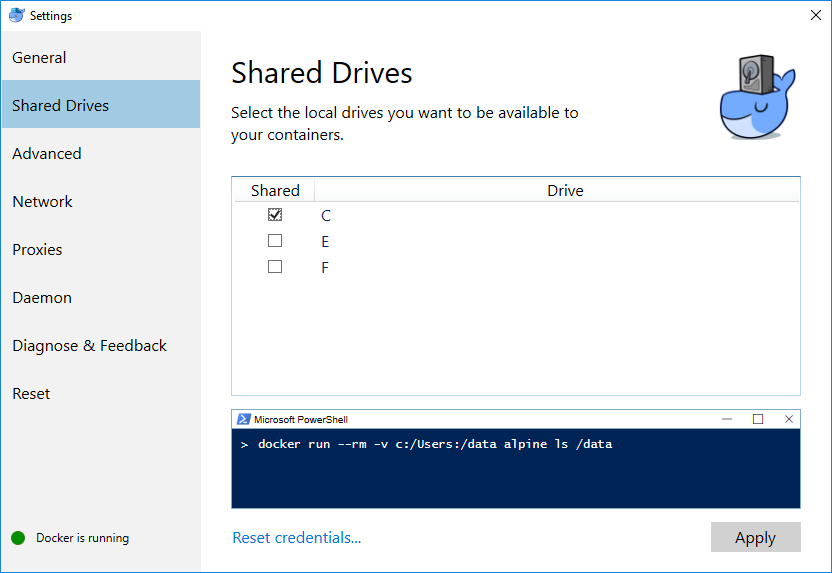
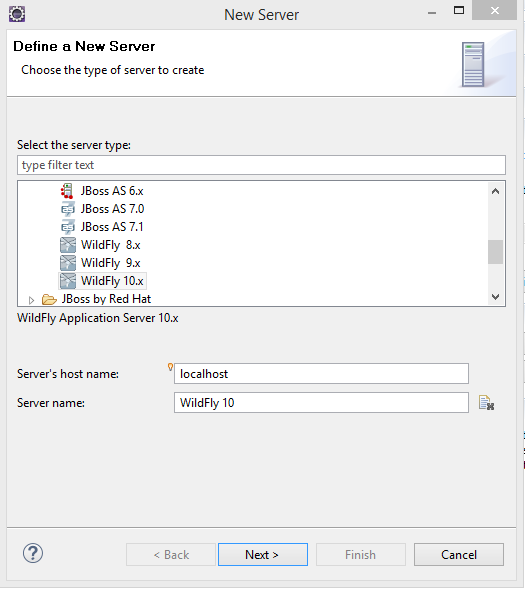
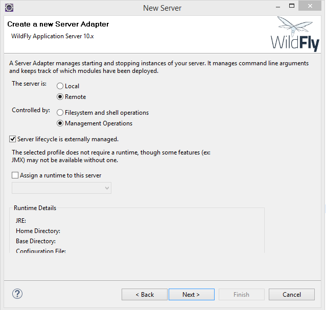
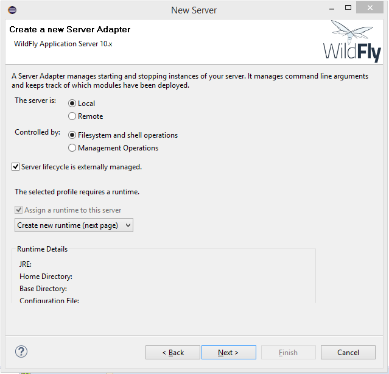
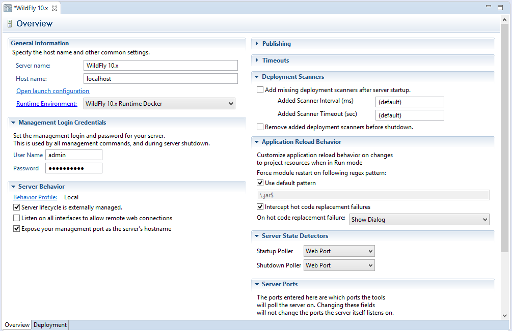

Docker is a containerization system that simplifies the development and deployment of software. In ACSE, it is used to avoid overly complex manual configuration steps of the development environment.

## Contents

1. [Installing Docker](#install)
1. [Installing the latest JDK](#jdk)
1. [Installing Eclipse](#eclipse)
1. [Extending Eclipse](#plugins)
<!-- 1. [Installing JBoss Tools](#jbosstools) -->

## Installing Docker

Which tool to install depends on your operating system:

   <section id="windows">
       <h5><a href="#windows">Windows 10 Professional 64-bit</a></h5>

       Install the current <a href="https://www.docker.com/docker-windows">Docker for Windows</a> application.
       In case this does not work (there are some hardware requirements such as a processor with Hyper-V support and virtualization enabled in the BIOS settings) you can fall back to the <a href="#legacy">solution for other Windows versions</a>.
         
       After successfully installing Docker, open the Docker settings (right click on the Docker icon in the Windows toolbar), select "Shared drives" and make sure your drive that contains the ACSE files (see below, "C:" in this tutorial) is checked.
        
       
   
</section>
   <section id="linux">
       <h5><a href="#linux">Linux</a></h5>

       Install the current <a href="https://docs.docker.com/engine/installation/linux/">Docker for Linux</a> application that is available for multiple distros.
   
</section>
   <section id="mac">
       <h5><a href="#mac">Mac (2010+) with macOS 10.10.3 Yosemite or newer</a></h5>

       Install the current <a href="https://www.docker.com/docker-mac">Docker for Mac</a> application.
   
</section>
   <section id="legacy">
		      <h5><a href="#legacy">Other Windows or Mac versions</a></h5>

          Older Versions of Windows or Mac that are not supported by the current tool can use the  <a href="https://www.docker.com/products/docker-toolbox">Docker Toolbox</a> application.
          Internally, Docker is installed within a virtual machine so that you can use it.
          However, this makes the environment setup a bit more complicated as will be highlighted in the following sections.
            

		      For Windows users with Docker Toolbox, you additionally need to establish a file system connection to the Docker machine. Therefore:
        <ol>
          <li> In your file system, create a folder, e.g. <code class="highlighter-rouge">C:\ACSE\dockerShared</code>.</li>
          <li> Open VirtualBox, select the "default" machine, click on <b>Change</b>.</li>
          <li> In the "Shared directory" tab, add a new entry that points to the local folder you just created and give it the name <code class="highlighter-rouge">/dockerShared</code>. Also, <b>activate</b> the checkboxes for automatic mounting and persistent creation.</li>
          <li> Close all dialogues with <b>OK</b>.</li>
        </ol>
		  
</section>

1. To verify your installation, start a Docker command line and run ``docker --version`` which should output some information.
 <small>For windows users: An annoying message "Unable to use system certificate pool: crypto/x509: system root pool is not available on Windows" might appear frequently. Nothing to worry, it's a [known issue](https://github.com/docker/docker/issues/30450) and fixed as of version 17.04; anyway it should have no impact on running Docker.</small>
1. You can continue with the Docker tutorial starting from [Step 2](https://docs.docker.com/get-started/part2/) to get some insights in how to handle Docker and learn about containers, images, Docker Hub and so on. However, necessary commands will also be provided on the exercise sheets.

[Docker Compose](https://docs.docker.com/compose/overview/) is an additional tool, which allows to manage multiple containers at once.
Windows 10, Linux and Mac users have to [install Docker Compose](https://docs.docker.com/compose/install/) separately; Docker Toolbox already bundles a version.

## Installing the latest Java 8 JDK

1. Make sure that the latest version of the **Java 8 Development Kit** (JDK 8 Update 161 or later) is installed on your computer. If the JDK is properly installed on your computer, you can jump to step 4 of this section, otherwise continue with the next step.
 <small>Java 9 has introduced a new module structure which leads to errors or additional adaptations in combination with other software used in the lecture. We therefore do not recommend using Java 9+ for the ACSE exercises.</small>
1. Go to [http://www.oracle.com/technetwork/java/javase/downloads/index.html](http://www.oracle.com/technetwork/java/javase/downloads/index.html) and follow the instructions on Oracle's website to **download** the latest version of the **Java 8 Development Kit** (**Java SE 8 Update 161** or later) for the operating system of your computer.
1. **Install** the **JDK** to a directory on your computer, e.g. ``C:\Java\jdk1.8.0_161`` on Windows.
1. **Create** an **[environment variable](#envvar)** called **``JAVA_HOME``** that points to the JDK installation directory, for example ``C:\Java\jdk1.8.0_161``.
1. You can check your installation by typing ``javac -version`` on your command line which should output the java version you just installed. If this is not the case you might also add the ``/bin`` directory of your Java installation to your ``PATH`` environment variable (keep in mind you have to open a new command line in order to see changes to the environment variables).

## Installing Eclipse

1. **Download** the **Eclipse IDE for Java EE Developers** for your operating system (e.g. *Oxygen.2*) from [https://www.eclipse.org/downloads/packages/release/oxygen/2](https://www.eclipse.org/downloads/packages/release/oxygen/2).
1. **Extract** the downloaded **archive** to a directory on your computer, e.g. ``C:\ACSE``. This will create a sub directory, like ``C:\ACSE\eclipse``.
1. **Start Eclipse**. The ``eclipse.exe`` is located in the installation directory. Wait for the "Workspace Launcher" window to pop up and **select a workspace directory**, for example ``C:\ACSE\projects``. This path must **not contain any spaces** either. The workspace directory is where all your projects will be stored. You may check the "Use this as the default and do not ask again" box to avoid this dialog from appearing on the next start. Click **"OK"** to close the dialog and get to the workbench window.

## Extending Eclipse
1. Select **Help** > **Install new Software...**
1. Click **Add...**, enter `http://download.eclipse.org/modeling/tmf/xtext/updates/composite/releases/` as new update site, and click **OK**.
1. From the dropdown menu, select **All Available Sites** to work with (the screenshots show another example).

1. Wait for the list of software to load and select all of the following items:

    <!--* _Modeling_
      * **QVT Operational SDK**
        _for model-to-model transformations_
    -->
    * _Xtext_
      * **Xtext Complete SDK** (at least version 2.13!)
        _for domain-specific language development_
      * **Xtend IDE** (at least version 2.13!)
        _for model-to-text transformations_

1. Click **Next** two times, check **Accept**, click **Finish** and wait for the packages to be installed.
1. Click **Yes** when prompted to restart.

<!--
## Installing JBoss Tools for Eclipse

For some exercises, you are required to deploy an application to the Wildfly application server.
To spare the manual installation and configuration, you can use the provided Docker image.
However, you need to configure Eclipse in order to automatically deploy your work from within your IDE.

  <section id="jbossDocker">
      <h5><a href="#jbossDocker">Docker for Linux/Windows/Mac</a></h5>

      <ol>
      <li> Open Eclipse, select <b>Help</b> > <b>Eclipse Marketplace...</b> from the Eclipse menu bar.
      </li><li> Search for "JBoss Tools" and <b>install JBoss Tools</b> (current version 4.5.2.Final).
      </li><li> Wait until "Calculating requirements..." has finished and make sure that all features are checked, then <b>confirm</b>.
      </li><li> When receiving "the installation cannot be completed as requested", choose the selected option to modify the items being installed and <b>Confirm</b>.
      </li><li> <b>Accept the license agreements</b> and click <b>Finish</b>.
      </li><li> When the download is complete, a security warning regarding "Unsigned content" will appear. <b>Accept with "OK"</b> to begin with the installation.
      </li><li> When prompted to do so, <b>Restart Now</b>.
      </li><li> After <b>closing</b> the <b>"Welcome" window</b>, switch to the "Java EE" perspective via <em>Window</em> > <em>Perspective</em> > <em>Open Perspective</em> > <em>Other...</em>. The selected perspective is indicated in the upper right corner as shown in the following figure:

          

      </li><li> In your Docker command line, fire up a Docker container for the Wildfly server using

      <pre class="highlight"><code>docker run --rm -it -p 8080:8080 -p 9990:9990 wwupi/wildfly-acse-2018
      </code></pre>

      In your browser, you should be able to see a Wildlfy welcome page when navigating to <code class="highlighter-rouge">http://localhost:8080</code>.

      </li><li> In Eclipse, activate the <b>"Servers" view</b> tab in the lower part of the window via <em>Window</em> > <em>Show view</em> > <em>Others...</em> . <b>Right-click</b> the empty area and <b>select "New > Server"</b> as shown in this screenshot:

          
      </li><li> In the "New Server" window select <b>"WildFly 11.0"</b> (from the JBoss Community category) <b>as server type</b>, set <code class="highlighter-rouge">localhost</code> as "Server's host name" and click <b>Next</b>.

          
      </li><li> On the next pages, <b>choose</b> the "Remote" server option, <b>choose</b> the server to be controlled by "Management Operations", <b>activate</b> "Server lifecycle is externally managed", <b>deselect</b> to assign a runtime, and click <b>Finish</b>.

          
      </li><li> Right-click the new Wildfly entry and choose <b>"Open"</b>.
      </li><li> In the Management Login Credentials tab <b>enter</b> the user name "admin" and the password "docker#admin".
      </li><li> <b>Click on the "Save" icon</b> in the menu bar.
      </li></ol>
  
</section>
   <section id="jbossToolbox">
       <h5><a href="#jbossToolbox">Docker Toolbox (old Windows/Mac versions)</a></h5>

       Unfortunately, you still need a Wildfly installation locally on your machine for Eclipse to work properly (although it does not need to be configured).
       <ol>
       <li>Therefore <b>get</b> the latest stable version of the <b>WildFly Application Server</b> (<b>12.0.0.Final</b>) from <a href="http://wildfly.org/downloads/">http://wildfly.org/downloads/</a>.
       </li><li>Extract the <b>zip</b> archive to a directory on your computer, e.g. <code class="highlighter-rouge">C:\ACSE</code> The path must <b>not contain any spaces</b>. A new directory, e.g. <code class="highlighter-rouge">C:\ACSE\wildfly-12.0.0.Final</code>, containing the WildFly files will be created.
       </li><li> Open Eclipse, select <b>Help</b> > <b>Eclipse Marketplace...</b> from the Eclipse menu bar.
       </li><li> Search for "JBoss Tools" and <b>install JBoss Tools</b> (current version 4.5.2.Final).
       </li><li> Wait until "Calculating requirements..." has finished and make sure that all features are checked, then <b>confirm</b>.
       </li><li> When receiving "the installation cannot be completed as requested", choose the selected option to modify the items being installed and <b>Confirm</b>.
       </li><li> <b>Accept the license agreements</b> and click <b>Finish</b>.
       </li><li> When the download is complete, a security warning regarding "Unsigned content" will appear. <b>Accept with "OK"</b> to begin with the installation.
       </li><li> When prompted to do so, <b>Restart Now</b>.
       </li><li> After <b>closing</b> the <b>"Welcome" window</b>, switch to the "Java EE" perspective via <em>Window</em> > <em>Perspective</em> > <em>Open Perspective</em> > <em>Other...</em>. The selected perspective is indicated in the upper right corner as shown in the following figure:

           

       </li><li> In your file system, create a folder, e.g. <code class="highlighter-rouge">C:\ACSE\dockerShared\deployments</code> (it must be in the shared folder established while <a href="#install">installing Docker</a>).
       </li><li> Check the current IP of Docker using <code class="highlighter-rouge">docker-machine ip</code>. On your local machine, this might output something like <code class="highlighter-rouge">192.168.99.100</code>.
       </li><li> In your Docker command line, fire up a Docker container for the Wildfly server and pass this directory to the virtual filesystem using

       <pre class="highlight"><code>docker run --rm -it -p 8080:8080 -v /dockerShared/deployments:/opt/jboss/wildfly/standalone/deployments/:rw wwupi/wildfly-acse-2018
       </code></pre>

       <small>For Windows users: Watch the conversion of backslashes to forward slashes.</small>

       </li><li> In Eclipse, activate the <b>"Servers" view</b> tab in the lower part of the window via <em>Window</em> > <em>Show view</em> > <em>Others...</em> . <b>Right-click</b> the empty area and <b>select "New > Server"</b> as shown in this screenshot:

           
       </li><li> In the "New Server" window select <b>"WildFly 11.0"</b> (from the JBoss Community category) <b>as server type</b>, set the Docker IP retrieved before as "Server's host name" and click <b>Next</b>.

           
       </li><li> On the next pages, <b>activate</b> "Server lifecycle is externally managed", and click <b>Next</b>.

           
       </li><li> <b>Set</b> the <b>"Home Directory"</b> entry to the installation directory of the WildFly AS, e.g. <code class="highlighter-rouge">C:\ACSE\wildfly-12.0.0.Final</code>, and <b>click "Finish"</b>.
       </li><li> Right-click the new Wildfly entry and choose <b>"Open"</b>.
       </li><li> In the "Deployment Scanners" section, <b>unselect</b> both checkboxes.

           
       </li><li> In the Deployment tab (bottom of the window), switch to the "Deployment" tab, <b>select</b> "Use a custom deployment folder" and set both paths to your local deployment folder created earlier (e.g. <code>C:\ACSE\dockerShared\deployments</code>).
       </li><li> <b>Click on the "Save" icon</b> in the menu bar.
       </li></ol>
   
</section>

-->

Congratulations, you have successfully set-up your development environment!
Continue with [running the sample application](018_tutorial_sample_app.html) or [setup your first Java EE project](020_tutorial_jboss_project.html).

## <a id="envvar" name="envvar" />How To Set Environment Variables

* **Windows 7 / 8 / 10**: Control Panel (*Systemsteuerung*) - System - choose Advanced System Settings (*Erweiterte Systemeinstellungen*) on the left - Advanced tab (*Erweitert*) - Environment Variables button (*Umgebungsvariablen*)
* **Linux**: Open a terminal window and type `export JAVA_HOME=/usr/lib/jvm/java-8-oracle` (using your installation path, of course). If Java is still not found you might need to add it to the path environment variable using `export PATH=$PATH:$JAVA_HOME/bin`.
