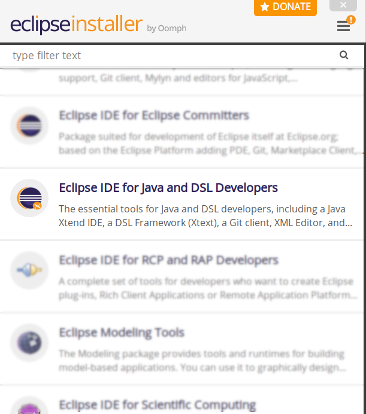
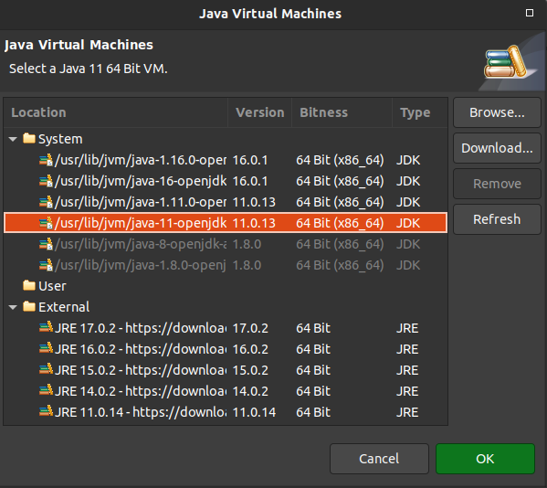

## Contents

1. [Installing Git](#git)
1. [Installing Docker](#install)
1. [Installing the latest Java 11 JDK](#jdk)
1. [Installing Eclipse](#eclipse)
1. [Extending Eclipse with Xtext and Xtend](#plugins)

## Installing Git
Git can, for example, be downloaded [here](https://git-scm.com/downloads).

## Installing Docker

Which tool to install depends on your operating system:

   <section id="windows">
       <h5><a href="#windows">Windows 10 Professional 64-bit</a></h5>

       Install the current <a href="https://www.docker.com/docker-windows">Docker for Windows</a> application.
       In case this does not work (there are some hardware requirements such as a processor with Hyper-V support and virtualization enabled in the BIOS settings) you can fall back to the <a href="#legacy">solution for other Windows versions</a>.
         
       After successfully installing Docker, open the Docker settings (right click on the Docker icon in the Windows toolbar), select "Shared drives" and make sure your drive that contains the ACSE files (see "Installing Eclipse" section below; "C:" in this tutorial) is checked.
        
       
   
</section>
   <section id="linux">
       <h5><a href="#linux">Linux</a></h5>

       Install the current <a href="https://docs.docker.com/engine/installation/linux/">Docker for Linux</a> application that is available for multiple distros.
   
</section>
   <section id="mac">
       <h5><a href="#mac">Mac (2010+) with macOS 10.10.3 Yosemite or newer</a></h5>

       Install the current <a href="https://www.docker.com/docker-mac">Docker for Mac</a> application.
   
</section>
   <section id="legacy">
          <h5><a href="#legacy">Other Windows or Mac versions</a></h5>

          Older Versions of Windows or Mac that are not supported by the current tool can use the <a href="https://www.docker.com/products/docker-toolbox">Docker Toolbox</a> application.
          Internally, Docker is installed within a virtual machine so that you can use it.
          However, this makes the environment setup a bit more complicated as will be highlighted in the following sections.
            
          For Windows users with Docker Toolbox, you additionally need to establish a file system connection to the Docker machine. Therefore:
        <ol>
          <li> In your file system, create a folder, e.g. <code class="highlighter-rouge">C:\ACSE</code>.</li>
          <li> Open VirtualBox, select the "default" machine, click on <b>Change</b>.</li>
          <li> In the "Shared directory" tab, add a new entry that points to the local folder you just created and give it the name <code class="highlighter-rouge">c:/ACSE</code>. Also, <b>activate</b> the checkboxes for automatic mounting and persistent creation.</li>
          <li> Close all dialogues with <b>OK</b>.</li>
          <li> Restart the machine by executing <b>docker-machine restart</b>.</li>
        </ol>

</section>

1. To verify your installation, start a Docker command line and run ``docker run hello-world`` which should output some information for getting started with Docker.
 <small>For windows users: An annoying message "Unable to use system certificate pool: crypto/x509: system root pool is not available on Windows" might appear frequently. Nothing to worry, it's a [known issue](https://github.com/docker/docker/issues/30450) and fixed as of version 17.04; anyway it should have no impact on running Docker.</small>
1. You can continue with the Docker tutorial starting from [Step 2](https://docs.docker.com/get-started/part2/) to get some insights in how to handle Docker and learn about containers, images, Docker Hub and so on. However, necessary commands will also be provided on the exercise sheets.

[Docker Compose](https://docs.docker.com/compose/overview/) is an additional tool, which allows to manage multiple containers at once.
Docker Desktop for Windows and Mac includes Compose. Linux users have to [install Docker Compose](https://docs.docker.com/compose/install/) separately; Docker Toolbox already bundles a version.

## Installing the latest Java 11 JDK

1. Make sure that the latest version of the **Java 11 Development Kit** is installed on your computer. 
If the JDK is properly installed on your computer, you can jump to step 4 of this section, otherwise continue with the next step.
1. Go to a provider of your liking, e.g., [https://adoptium.net/](https://adoptium.net/?variant=openjdk11&jvmVariant=hotspot) or [http://www.oracle.com/technetwork/java/javase/downloads/index.html](http://www.oracle.com/technetwork/java/javase/downloads/index.html) and follow the instructions to **download** the latest version of the **Java 11 Development Kit** for the operating system of your computer.
1. **Install** the **JDK** to a directory on your computer, e.g. ``C:\Java\<jdk>`` on Windows.
1. **Create** an **[environment variable](#envvar)** called **``JAVA_HOME``** that points to the JDK installation directory, for example ``C:\Java\<jdk>``. You could also be able to directly set this variable while installing the JDK.
1. You can check your installation by typing ``javac -version`` on your command line which should output the java version you just installed. If this is not the case you might also add the ``/bin`` directory of your Java installation to your ``PATH`` environment variable (keep in mind you have to open a new command line in order to see changes to the environment variables). For Linux and macOS, see the section at the bottom of this document.

## Installing Eclipse

1. **Download** the **Eclipse IDE for Java and DSL Developers** for your operating system from [https://www.eclipse.org/downloads/](https://www.eclipse.org/downloads/). Via the given page an installer will be downloaded.
2. **Extract** the archive and **open** the installer.
3. Be sure to **select** ``Eclipse IDE for Java and DSL Developers``. This package already includes Xtext and Xtend which otherwise have to be installed manually.

1. Set up the Java 11+ VM. For this, **select** the Java 11 JDK you installed in the previous step.

1. Start installing. The respective packages are downloaded. **This might take some time**.
1. **Start Eclipse**. The executable (``eclipse.exe`` or ``eclipse``) is located in the installation directory. Wait for the "Workspace Launcher" window to pop up and **select a workspace directory**, for example ``C:\ACSE\projects``. This path must **not contain any spaces** either. The workspace directory is where all your projects will be stored. You may check the "Use this as the default and do not ask again" box to avoid this dialog from appearing on the next start. You might also want to create a different workspace for each project. Click **"OK"** to close the dialog and get to the workbench window.

The Eclipse IDE comes with a Git integration tool, Java Development tools, Xtext and Xtend, and a Maven integration.

## Extending Eclipse with Xtext and Xtend
You can skip this step if you already installed the ``Eclipse IDE for Java and DSL Developers``.
1. Select **Help** > **Install new Software...**
1. Specify Work with: Xtend - http://download.eclipse.org/modeling/tmf/xtext/updates/composite/releases/. This can take some time.

1. Wait for the list of software to load (this can take some time) and select all of the following items:
    * _General Purpose Tools_
      * **Xtext Complete SDK** (at least version 2.25!)
        _for domain-specific language development_
    * _Programming Languages_
      * **Xtend IDE** (at least version 2.25!)
        _for model-to-text transformations_

1. Click **Next** two times, check **Accept**, click **Finish** and wait for the packages to be installed.
1. Click **Yes** when prompted to restart.

## Installing Papyrus
1. Select **Help** > **Install new Software...**
1. Specify Work with: https://download.eclipse.org/modeling/mdt/papyrus/updates/releases/2021-12/

1. Select the version of Papyrus, it should be 6.0.0.202112011019
1. Click **Next**, read and accept the license aggreement and click **Finish**
1. Click **Restart now** when prompted to restart
1. After creating a Papyrus project, you now can model, e.g., class diagrams with the known UML elements.

## <a id="envvar" name="envvar" />How To Set Environment Variables

* **Windows 7 / 8 / 10**: Control Panel (*Systemsteuerung*) - System - choose Advanced System Settings (*Erweiterte Systemeinstellungen*) on the left - Advanced tab (*Erweitert*) - Environment Variables button (*Umgebungsvariablen*)
* **Linux / macOS**: Open you ~/.profile- and ~/.bashrc- or ~/.bash_profile-files.  Type `export JAVA_HOME=/usr/lib/jvm/<your version>` (using your installation path, of course). If Java is still not found you might need to add it to the path environment variable using `export PATH=$PATH:$JAVA_HOME/bin`. You need to log out and log back in again for the changes to be applied.

Congratulations, you have successfully set up your development environment!
