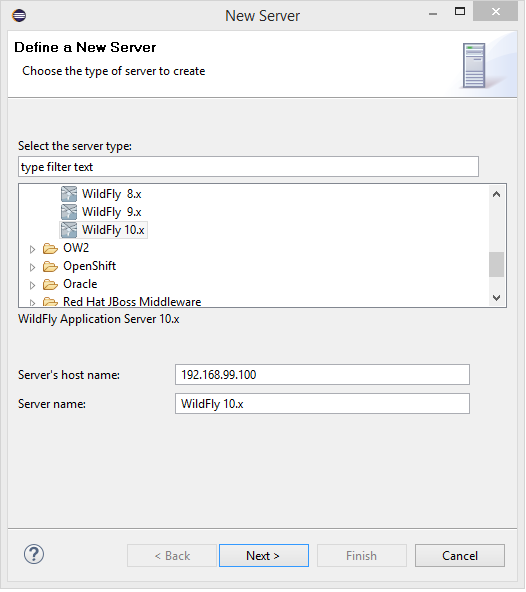

Docker is a containerization system that simplifies the development and deployment of software. In ACSE, it is used to avoid overly complex manual configuration steps of the development environment.

## Contents

1. [Installing the latest JDK](#jdk)
1. [Installing Eclipse](#eclipse)
1. [Extending Eclipse](#plugins)
1. [Installing Docker](#install)
1. [Installing JBoss Tools](#jbosstools)

## <a id="jdk" name="jdk"></a>Installing the latest JDK

1. Make sure that the latest version of the **Java Development Kit** (JDK 8 Update 121 or later) is installed on your computer. If the JDK is properly installed on your computer, you can jump to step 4 of this section, otherwise continue with the next step.
1. Go to [http://www.oracle.com/technetwork/java/javase/downloads/index.html](http://www.oracle.com/technetwork/java/javase/downloads/index.html) and follow the instructions on Oracle's website to **download** the latest version of the **JDK** (**Java SE 8 Update 121** or later) for the operating system of your computer.
1. **Install** the **JDK** to a directory on your computer, e.g. ``C:\Java\jdk1.8.0_121`` on Windows.
1. **Create** an **[environment variable](#envvar)** called **``JAVA_HOME``** that points to the JDK installation directory, for example ``C:\Java\jdk1.8.0_121``.

## <a id="eclipse" name="eclipse"></a>Installing Eclipse

1. **Download** the **Eclipse IDE for Java and DSL Developers** for your operating system (version 4.6.2, *Neon.2*) from [http://www.eclipse.org/downloads/packages/eclipse-ide-java-and-dsl-developers/neon2](http://www.eclipse.org/downloads/packages/eclipse-ide-java-and-dsl-developers/neon2). It includes:

   * EMF -- Eclipse Modeling Framework SDK (for basic modelling features),
   * Xtext Complete SDK (for implementing DSLs), and
   * Xtend IDE (useful for model-to-text transformations).


1. **Extract** the downloaded **archive** to a directory on your computer, e.g. ``C:\ACSE``. This will create a sub directory, like ``C:\ACSE\eclipse``.
1. **Start Eclipse**. The ``eclipse.exe`` is located in the installation directory. Wait for the "Workspace Launcher" window to pop up and **select a workspace directory**, for example ``C:\ACSE\projects``. This path must **not contain any spaces** either. The workspace directory is where all your projects will be stored. You may check the "Use this as the default and do not ask again" box to avoid this dialog from appearing on the next start. Click **"OK"** to close the dialog and get to the workbench window.

## <a id="plugins" name="plugins"></a>Extending Eclipse
1. Select **Help** > **Install new Software...**
1. From the dropdown menu, select **Neon** as the site to work with (the screenshots show another example).

1. Wait for the list of software to load and select all of the following items:

   * _Modeling_
      * **QVT Operational SDK**
        _for model-to-model transformations._
      * **Papyrus UML**
        _for UML diagrams_
   * _Web, XML, Java EE and OSGi Enterprise Development_
      * **Eclipse Java EE Developer Tools**
        _for Java EE development_
      * **Eclipse Java Web Developer Tools**
        _for Java Web development_
      * **JSF Tools**
        _for development of JSF web apps_
   * _Database Development_
      * **Data Tools Platform Extender SDK**
        _for data-centric technologies_

1. Click **Next** two times, check **Accept**, click **Finish** and wait for the packages to be installed.
1. Click **Yes** when prompted to restart.
<!--1. Enable Java code completion, otherwise, you may miss out on code completion for Java classes:
   1. Once restarted, open **Window** > **Preferences**.
   1. Choose **Java** > **Editor** > **Content Assist** > **Advanced**.
   1. Enable *Java Proposals*.-->

## <a id="install" name="install"></a>Installing Docker

1. Which tool to install depends on your operating system:

 * Windows 10 Professional 64-bit: [Docker for Windows](https://www.docker.com/docker-windows)
 * Other Windows versions: [Docker Toolbox](https://www.docker.com/products/docker-toolbox)
 * Linux (various distros): [Docker for Linux](https://docs.docker.com/engine/installation/linux/)
 * Mac 2010 or newer with macOS 10.10.3. Yosemite or newer: [Docker for Mac](https://www.docker.com/docker-mac)
 * Older Mac versions: [Docker Toolbox](https://www.docker.com/products/docker-toolbox)

2. To verify your installation, start a docker command line and run ``docker version`` which should output some information.
<br><small>For windows users: An annoying message "Unable to use system certificate pool: crypto/x509: system root pool is not available on Windows" might appear frequently. Nothing to worry, it's a [known issue](https://github.com/docker/docker/issues/30450) but not yet fixed and should have no impact on running docker.</small>

3. You can continue with the Docker tutorial starting from [Step 3](https://docs.docker.com/engine/getstarted/step_one/#step-3-verify-your-installation) to get some insights in how to handle Docker and learn about containers, Docker Hub and so on. However, necessary commands will also be provided on the exercise sheets.


## <a id="jbosstools" name="jbosstools"></a>Installing JBoss Tools for Eclipse

For some exercises, you are required to deploy an application to the Wildfly application server.
To spare the manual installation and configuration, you can use the provided docker container.
However, you need to configure Eclipse in order to automatically deploy your work in progress from within your IDE.

1. Select **Help** > **Eclipse Marketplace...** from the Eclipse menu bar. Choose "Eclipse Marketplace" if prompted for a marketplace catalog.
1. Search for "JBoss Tools" and **install JBoss Tools**, version 4.4.3.Final.
1. Wait until "Calculating requirements..." has finished and make sure that all features are checked, then **confirm**.
1. **Accept the license agreements** and click **"Finish"**.
1. When the download is complete, a security warning regarding "Unsigned content" will appear. **Accept with "OK"** to begin with the installation.
1. When prompted to do so, **"Restart Now"**.
1. After **closing** the **"Welcome" window** you will see the "Java EE" perspective. The selected perspective is indicated in the upper right corner as shown in the following figure:

    

   If the Java EE button is not visible you can change to the Java EE perspective via *Window* > *Perspective* > *Open Perspective* > *Other...* . In the "Open Perspective" dialog double click the Java EE entry.

1. In your file system, create a folder, e.g. ``C:\ACSE\deployments``.
1. In your Docker command line, check the current IP of docker using ``docker-machine ip``. On your local machine, this might output something like ``192.168.99.100``.
1. Now fire up the docker container for the Wildfly server and pass this directory to the virtual filesystem using
```
docker run -it -p 8080:8080 -v /c/ACSE/deployments/:/opt/jboss/wildlfy/standalone/deployments/:rw jboss/wildfly
```
<small>Watch the conversion of Windows backslashes to forward slashes and that "C:\" becomes "/c/" (on Linux you can use normal paths).</small>

1. In Eclipse, activate the **"Servers" view** tab in the lower right of the window. **Right-click** the empty area and **select "New > Server"** as shown in this screenshot:
    
1. In the "New Server" window select **"WildFly 10.1"** (from the JBoss Community category) **as server type**, set the docker IP as "Server's host name" and click **Next**.
    
1. On the next pages, **activate** "Server lifecycle is externally managed", and after clicking **Next** untick both checkboxes in the "Deployment scanners" section.
1. Finally, **select** "Use a custom deploy folder" and set it to your local folder created in Step 8.
<!--   **Set** the **"Home Directory"** entry to the installation directory of the WildFly AS, e.g. ``C:\ACSE\wildfly-10.1.0.Final``, and **click "Finish"**.-->
1. In the "Servers" view **select the newly created server** and click the green **start button**.
    

   A new "Console" view will open showing the startup logs of the WildFly AS.

Congratulations, you have successfully set-up your development environment!
Continue with the [setup of your first Java EE project](020_tutorial_jboss_project.html).

## <a id="envvar" name="envvar" />How To Set Environment Variables

* **Windows XP**: Open the Control Panel (*Systemsteuerung*) from the Start Menu, switch to Classic View (*Klassische Ansicht*) if necessary, open the System Control Panel applet (*System*), select the Advanced tab (*Erweitert*), and click on the Environment Variables button (*Umgebungsvariablen*).
* **Windows 7 / 8 / 10**: Control Panel (*Systemsteuerung*) - System - choose Advanced System Settings (*Erweiterte Systemeinstellungen*) on the left - Advanced tab (*Erweitert*) - Environment Variables button (*Umgebungsvariablen*)
