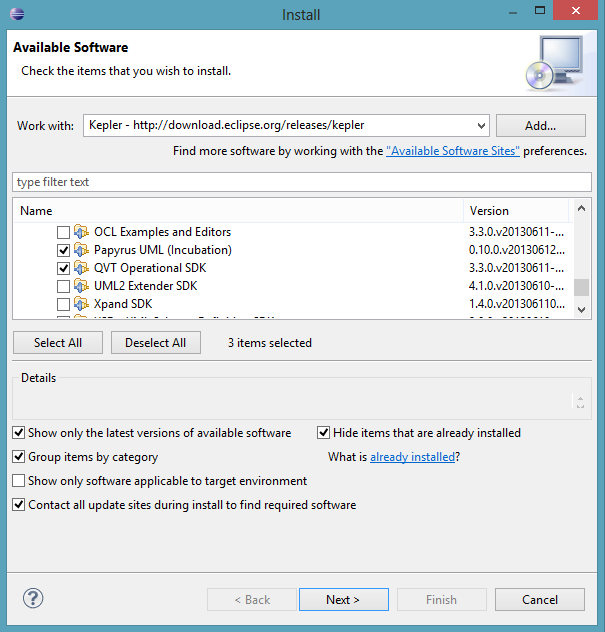
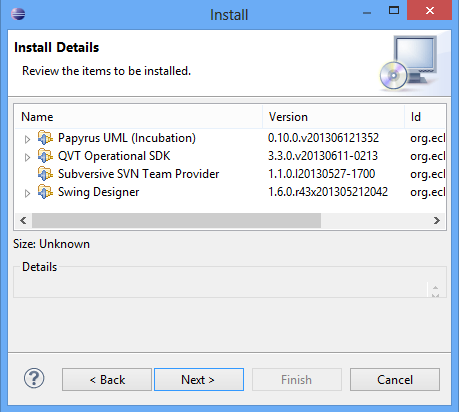
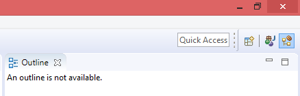
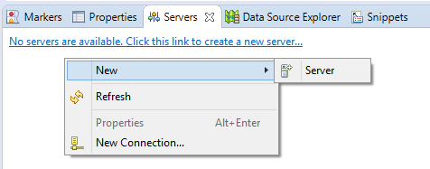
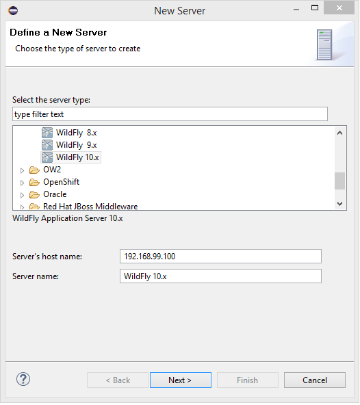

## Contents

1. [Installing the latest JDK](#jdk)
1. [Installing WildFly](#wildfly)
1. [Installing Eclipse](#eclipse)
1. [Extending Eclipse](#plugins)
1. [Installing JBoss Tools](#jbosstools)

## <a id="jdk" name="jdk" />Installing the latest JDK

1. Make sure that the latest version of the **Java Development Kit** (JDK 8 Update 77 or later) is installed on your computer. If the JDK is properly installed on your computer, you can jump to step 4 of this section, otherwise continue with the next step.
1. Go to [http://www.oracle.com/technetwork/java/javase/downloads/index.html](http://www.oracle.com/technetwork/java/javase/downloads/index.html) and follow the instructions on Oracle's website to **download** the latest version of the **JDK** (**Java SE 8 Update 77** or later) for the operating system of your computer.
1. **Install** the **JDK** to a directory on your computer, e.g. **``C:\Java\jdk8_77``**.
1. **Create** an **[environment variable](#envvar)** called **``JAVA_HOME``** that points to the JDK installation directory, for example ``C:\Java\jdk8_77``.

## <a id="wildfly" name="wildfly" />Installing WildFly

1. **Get** the latest stable version of the **WildFly Application Server** (**10.0.0.Final**) from [http://wildfly.org/downloads/](http://wildfly.org/downloads/) (``wildfly-10.0.0.Final.zip``).
1. **Extract** the **zip** archive to a directory on your computer, e.g. ``C:\ACSE``. The path must **not contain any spaces**. A new directory, e.g. ``C:\ACSE\wildfly-10.0.0.Final``, containing the WildFly files will be created.
1. Use the script ``<WildFly directory>\bin\standalone.bat`` to start the WildFly server and check the installation. After startup, you should be able to access the web server at [http://localhost:8080](http://localhost:8080).
1. Open the link **Administration Console** and follow the instructions to add a new management user.
1. After creating a user revisit the **Administration Console**.
1. Go to [**Deployments**](http://localhost:9990/console/App.html#standalone-deployments) and click **Add** to upload [hsqldb.jar](hsqldb.jar). Click **Next**, select the hsqldb.jar, and click **Next**. Make sure that the deployed file is **enabled** and click **Finish**.
1. Go to **Configuration** > **Subsystems** > **Datasources** > **Non-XA** and click **Add**. Use the following information to create a datasource:

   * Datasource: **Custom**
   * Name: **DefaultDS**
   * JNDI Name: **java:/DefaultDS**
   * JDBC Driver: Click **Detected Driver** and choose **hsqldb.jar**
   * Connection URL: **jdbc:hsqldb:${jboss.server.data.dir}${/}hypersonic${/}localDB;shutdown=true**
   * username: **sa**

1. Ensure that the **datasource** is **enabled** (Configuration > Subsystems > Datasources > Non-XA > DefaultDS).
1. In order to stop the server, press CTRL-C in the console window that was opened during step 3.

Alternatively to steps 4-8, you can use the JBoss-CLI to deploy the HSQLDB driver and add the data source: ``./jboss-cli.sh -c "deploy ~/Downloads/hsqldb.jar,data-source add --driver-name=hsqldb.jar --use-ccm=false --jta=false --user-name=sa --name=DefaultDS --jndi-name=java:/DefaultDS --connection-url=jdbc:hsqldb:\$\{jboss.server.data.dir\}\$\{/\}hypersonic\$\{/\}localDB;shutdown=true"``

## <a id="eclipse" name="eclipse" />Installing Eclipse

1. **Download** the **Eclipse IDE for Java and DSL Developers** for your operating system (version 4.5.2, *Mars.2*) from [http://www.eclipse.org/downloads/packages/eclipse-ide-java-and-dsl-developers/mars2](http://www.eclipse.org/downloads/packages/eclipse-ide-java-and-dsl-developers/mars2). It includes:

   * EMF -- Eclipse Modeling Framework SDK (for basic modelling features),
   * Xtext Complete SDK (for implementing DSLs), and
   * Xtend IDE (useful for model-to-text transformations).

1. **Extract** the downloaded **archive** to a directory on your computer, e.g. ``C:\ACSE``. This will create a sub directory, like ``C:\ACSE\eclipse``.
1. **Start Eclipse**. The ``eclipse.exe`` is located in the installation directory. Wait for the "Workspace Launcher" window to pop up and **select a workspace directory**, for example ``C:\ACSE\projects``. This path must **not contain any spaces** either. The workspace directory is where all your projects will be stored. You may check the "Use this as the default and do not ask again" box to avoid this dialog from appearing on the next start. Click **"OK"** to close the dialog and get to the workbench window.

## <a id="plugins" name="plugins" />Extending Eclipse
1. Select **Help** > **Install new Software...**
1. From the dropdown menu, select **Mars** as the site to work with (the screenshots show another example).
1. Wait for the list of software to load and select all of the following items:

   * _Modeling_
      * **QVT Operational SDK**
        _for model-to-model transformations._
      * **Papyrus UML**
        _for UML diagrams_
   * _Web, XML, Java EE and OSGi Enterprise Development_
      * **Eclipse Java EE Developer Tools**
        _for Java EE development_
      * **Eclipse Java Web Developer Tools**
        _for Java Web development_
      * **JSF Tools**
        _for development of JSF web apps_
   * _Database Development_
      * **Data Tools Platform Extender SDK**
        _for data centric technologies_

    
    Eclipse --> Install New Software...

    
    Selected new software for Eclipse

1. Click *Next* two times, check *Accept*, click *Finish* and wait for the packages to be installed.
1. Click Yes when prompted to restart.
1. Enable Java code completion, otherwise, you may miss out on code completion for Java classes:
   1. Once restarted, open **Window** > **Preferences**.
   1. Choose **Java** > **Editor** > **Content Assisst** > **Advanced**.
   1. Enable *Java Proposals*.

## <a id="jbosstools" name="jbosstools" />Installing JBoss Tools for Eclipse

1. Select **Help** > **Eclipse Marketplace...** from the Eclipse menu bar. Choose "Eclipse Marketplace" if prompted for a marketplace catalog.
1. Search for "JBoss Tools" and **install JBoss Tools**, version 4.3.0.Final.
1. Wait until "Calculating requirements..." has finished and make sure that all features are checked, then **confirm**.
1. **Accept the license agreements** and click **"Finish"**.
1. When the download is complete, a security warning regarding "Unsigned content" will appear. **Accept with "OK"** to begin with the installation.
1. When prompted to do so, **"Restart Now"**.
1. After **closing** the **"Welcome" window** you will see the "Java EE" perspective. The selected perspective is indicated in the upper right corner as shown in the following figure:

    

   If the Java EE button is not visible you can change to the Java EE perspective via *Window* > *Perspective* > *Open Perspective* > *Other...* . In the "Open Perspective" dialog double click the Java EE entry.
1. **Activate** the **"Servers" view** tab in the lower right of the window. **Right-click** the empty area and **select "New-&gt;Server"** as shown in this screenshot:
    
1. In the "New Server" window select **"WildFly 10.0"** (from the JBoss Community category) **as server type** and click **"Next"** two times.
    

   **Set** the **"Home Directory"** entry to the installation directory of the WildFly AS, e.g. ``C:\ACSE\wildfly-10.0.0.Final``, and **click "Finish"**.
1. In the "Servers" view **select the newly created server** and click the green **start button**.
    

   A new "Console" view will open showing the startup logs of the WildFly AS.

Congratulations, you have successfully set-up your development environment!
Continue with the [setup of your first Java EE project](020_tutorial_jboss_project.html).

## <a id="envvar" name="envvar" />How To Set Environment Variables

* **Windows XP**: Open the Control Panel (*Systemsteuerung*) from the Start Menu, switch to Classic View (*Klassische Ansicht*) if necessary, open the System Control Panel applet (*System*), select the Advanced tab (*Erweitert*), and click on the Environment Variables button (*Umgebungsvariablen*).
* **Windows 7**: Control Panel (*Systemsteuerung*) - System - choose Advanced System Settings (*Erweiterte Systemeinstellungen*) on the left - Advanced tab (*Erweitert*) - Environment Variables button (*Umgebungsvariablen*)
