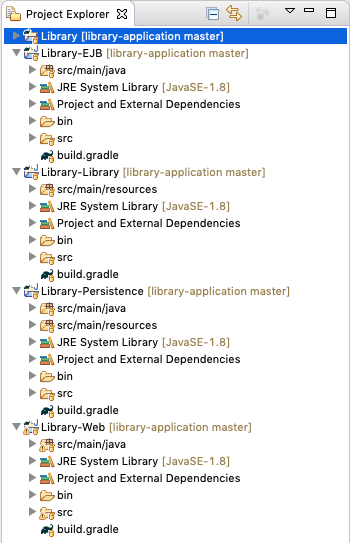

## Contents

1. [Running the Example Application with Docker](#run)
1. [Importing the Example Application into Eclipse](#import)

## <a id="run" name="run"></a>Running the Example Application
In case you ask yourself what is the benefit of installing and configuring Docker, the main reason is the simple deployment of applications through Docker containers.
To see the Java EE example of a library application in action, only three steps are required:

1. Make sure **Docker** is properly **installed**  ([tutorial](010_setting_up_environment_with_docker.html)) and you know your Docker IP (typically `localhost`; when using Docker Toolbox, run  `docker-machine ip` on your command line).
1. Open your Docker command line and run
```
docker run --rm -it -p 8080:8080 wwupi/library-application
```
1. Wait while Docker loads the application and then go to [`http://DockerIP:8080/Library-Web-1.0/`](http://DockerIP:8080/Library-Web-1.0/) in your browser. That's all it takes!

## <a id="import" name="import"></a>Importing the Example Application into Eclipse
This tutorial will show how to import a Java EE application using the example of a library application. It allows you to quickly get started with Eclipse, Java EE and JBoss Tools. The next tutorial, [Creating Java EE projects with JBoss Tools](020_tutorial_jboss_project.html), will show how you can create your own Java EE projects.

1. Make sure **Docker** and **Eclipse** are properly **installed** and configured ([tutorial](010_setting_up_environment_with_docker.html)).
1. **Start Eclipse** and make sure the **Java EE perspective** is opened.
1. **Download and extract** the [library application source files](https://github.com/wwu-pi/library-application/archive/master.zip) or **clone** it (`git clone https://github.com/wwu-pi/library-application.git`) to a temporary folder.
1. **Select** *File* > *Import...* from the Eclipse menu bar.
1. Choose *Gradle* > *Existing Gradle Project* and click next.
1. Choose **"Project root directory"** and browse to the location from step 1.
1. If you have never imported a Gradle project, you might want to configure workspace Gradle settings. For this click on **"Configure Workspace Settings..."**. Make sure *Gradle wrapper* is selected and *Java home* points to the location of a Java 8 installation in case you have multiple JDKs installed side by side. You might also want to activate *Automatic Project Synchronization*. Click on **Apply and Close** if you are done. Then click on **Next**.
1. **Four projects** called Library, Library-EJB, Library-Persistence and Library-Web should appear under "Library". Click on **"Finish"**.
1. The project explorer should now contain the four projects. Eclipse will automatically validate and build the projects.

    
1. To build the project into a deployable EAR file, open the **Gradle Tasks** panel and double click on *Library* > *build* > *assemble*. After that you can also use the *play button* at the top. The EAR file is located in Library/build/libs/.
1. Finally, deploy the application to the Wildfly application server:

<div class="accordion vertical">
  <section id="runWithDocker">
  <h5><a href="#runWithDocker">Docker for Linux/Windows/Mac</a></h5><div>

  In your Docker command line, navigate to the project root directory and fire up the Docker container for the Wildfly server using

  <pre class="highlight"><code>
  cd path/to/project
  docker-compose up
  </code></pre>

  <small>For Windows users: Watch the conversion of backslashes to forward slashes.</small>
  <br /><br />

  Wait until the application has been deployed (check the Docker command line output).
  The Library web application is then accessible under <a href="http://localhost:8080/Library-Web-1.0/">http://localhost:8080/Library-Web-1.0/</a> and the server output is shown in the Docker command line.
  <br /><br />

  To deploy a new version, you can simply rebuild the EAR file. WildFly will notice the new/updated file and automatically start the deployment.
  </div>
  </section>

  <section id="runWithToolbox">
  <h5><a href="#runWithToolbox">Docker Toolbox (old Windows/Mac versions)</a></h5>
  <div>
  Check the current IP of Docker using <code class="highlighter-rouge">docker-machine ip</code>.
  On your local machine, this might output something like <code class="highlighter-rouge">192.168.99.100</code>.
  <br /><br />

  In your Docker command line, fire up the Docker container for the Wildfly server using

  <pre class="highlight"><code>
  cd path/to/project
  docker-compose up
  </code></pre>

  <small>For Windows users: Watch the conversion of backslashes to forward slashes.</small>
  <br /><br />

  Wait until the application has been deployed (check the Docker command line output).
  The Library web application is then accessible under <a href="http://dockerIP:8080/Library-Web-1.0/">http://dockerIP:8080/Library-Web-1.0/</a> and the server output is shown in the Docker command line.
  <br /><br />

  To deploy a new version, you can simply rebuild the EAR file. WildFly will notice the new/updated file and automatically start the deployment.
  </div>
  </section>
</div>

---
