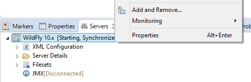

## Contents

1. [Running the Example Application with Docker](#run)
1. [Importing the Example Application into Eclipse](#import)

## <a id="run" name="run"></a>Running the Example Application
In case you ask yourself what is the benefit of installing and configuring Docker, the main reason is the simple deployment of applications through Docker containers.
To see the Java EE example of a library application in action, only three steps are required:

1. Make sure **Docker** is properly **installed**  ([tutorial](010_setting_up_environment_with_docker.html)) and you know your Docker IP (typically `localhost`; when using Docker Toolbox, run  `docker-machine ip` on your command line).
1. Open your Docker command line and run
```
docker run --rm -it -p 8080:8080 wwupi/library-application
```
1. Wait while Docker loads the application and then go to `http://DockerIP:8080/Library-Web` in your browser. That's all it takes!

## <a id="import" name="import"></a>Importing the Example Application into Eclipse
This tutorial will show how to import a Java EE application using the example of a library application. It allows you to quickly get started with Eclipse, Java EE and JBoss Tools. The next tutorial, [Creating Java EE projects with JBoss Tools](020_tutorial_jboss_project.html), will show how you can create your own Java EE projects.

1. Make sure **Docker** and **Eclipse with JBoss Tools Plug-in** are properly **installed** and configured ([tutorial](010_setting_up_environment_with_docker.html)).
1. **Start Eclipse** and make sure the **Java EE perspective** is opened.
1. **Download** the [library application source files](https://github.com/wwu-pi/library-application/archive/master.zip) or **clone** the [library application project](https://github.com/wwu-pi/library-application/) to a temporary folder.
1. **Select** *File* > *Import...* from the Eclipse menu bar.
1. Choose *General* > *Existing Projects into Workspace* and click next.
1. Choose **"Select archive file"** and browse to the archive from step 1.
1. **Four projects** called Library, Library-EJB, Library-Persistence and Library-Web should appear under "Projects". Make sure all four are selected and **"Finish"**.
1. The project explorer should now contain the four projects. Eclipse will automatically validate and build the projects.

    

<!--
1. <a id="import-deploy" name="import-deploy" />In the "Servers" tab, **right-click** on your **WildFly 12 server** and select **"Add and Remove..."**.

    

1. Select the **library application** and click *Add >*, then "Finish. <small>Should Eclipse fail to display any applications, ensure that all EAR projects in the workspace contain an ``EarContent`` directory. In case the project was imported from VCS (e.g. git), an empty ``.gitkeep`` file within ``EarContent`` will ensure the directory is always present.</small>
-->
1. Finally, deploy the application to the Wildfly application server:

<div class="accordion vertical">
  <section id="runWithDocker">
      <h5><a href="#runWithDocker">Docker for Linux/Windows/Mac</a></h5><div>
      In your Docker command line, fire up the Docker container for the Wildfly server using

      <pre class="highlight"><code>docker run --rm -it -p 8080:8080 -v local-path:/opt/jboss/wildfly/standalone/deployments/:rw wwupi/wildfly-acse-2018
      </code></pre>

      The <code>local-path</code> should point to the "deployments" folder established while <a href="010_setting_up_environment_with_docker.html">setting up the development environment</a>.
      On Windows, folders need to be specified with forward slashes, e.g. "C:/ACSE/deployments".
      <br /><br />

      In Eclipse, right-click on the "Library" project and choose "Export" | "EAR file".
      The destination should be the deployments folder mentioned above (allow overwriting existing files when re-deploying).
      <br />
      Wildfly will notice the new/updated file and automatically start the deployment.
<!--
      In the "Servers" tab in Eclipse, <b>right-click</b> on the WildFly server and <b>click on "Start"</b> (you don't actually start the server as it is managed by Docker, so it will quickly move to the state "Started").
      <br />
      <b>Right-click</b> on the WildFly server again and <b>click on "Publish"</b> to create the package and deploy it to the server.
      <br /><br />
-->
      <br /><br />
      Wait until the application has been deployed (check the Docker command line output).
      The Library web application is then accessible under <a href="http://localhost:8080/Library-Web/">http://localhost:8080/Library-Web/</a> and the server output is shown in the Docker command line.
  </div></section>
   <section id="runWithToolbox">
       <h5><a href="#runWithToolbox">Docker Toolbox (old Windows/Mac versions)</a></h5><div>
       Check the current IP of Docker using <code class="highlighter-rouge">docker-machine ip</code>.
       On your local machine, this might output something like <code class="highlighter-rouge">192.168.99.100</code>.
       <br /><br />
       In your Docker command line, fire up the Docker container for the Wildfly server using
       <pre class="highlight"><code>docker run --rm -it -p 8080:8080 -v /dockerShared/deployments:/opt/jboss/wildfly/standalone/deployments/:rw wwupi/wildfly-acse-2018
       </code></pre>

      <small>For Windows users: Watch the conversion of backslashes to forward slashes.</small>
      <br /><br />

      In Eclipse, right-click on the "Library" project and choose "Export" | "EAR file".
      The destination should be the deployments folder mentioned above (allow overwriting existing files when re-deploying).
      <br />
      Wildfly will notice the new/updated file and automatically start the deployment.
      <!--
      In the "Servers" tab in Eclipse, <b>right-click</b> on the WildFly server and <b>click on "Start"</b> (you don't actually start the server as it is managed by Docker, so it will quickly move to the state "Started").
      <br />
      <b>Right-click</b> on the WildFly server again and <b>click on "Publish"</b> to create the package and deploy it to the server.
      <br /><br />
      -->
      <br /><br />
      Wait until the application has been deployed. The Library web application is then accessible under <a href="http://dockerIP:8080/Library-Web/">http://dockerIP:8080/Library-Web/</a> using the above IP.
      The server output is shown in the Docker command line.
   </div></section>
</div>


---
