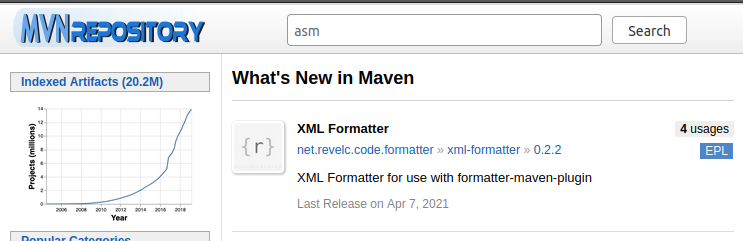
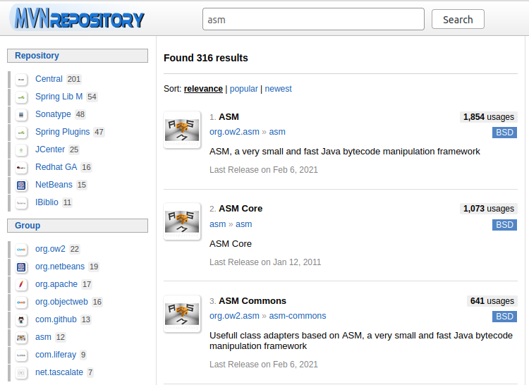
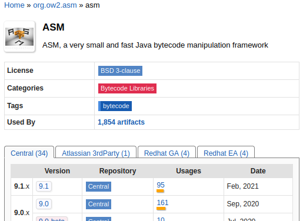
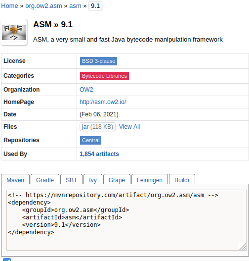

# Maven
[Apache Maven](https://maven.apache.org/) is a build automation tool used for Java applications. Maven can be used
to efficiently manage and retrieve software dependencies. With Maven, for instance, it can be made sure that multiple 
developers use the same version of dependencies, without them having to find and include various .jar-packages themselves.

## Maven Build Lifecycle
Maven has specific, configurable, [lifecycles](https://maven.apache.org/guides/introduction/introduction-to-the-lifecycle.html).
These lifecycles each have a sequence of phases that are executed to distribute a software artifact. 
The <code>default</code> lifecycle handles the project deployment and is divided into several (to be precise: 21) 
[phases](https://maven.apache.org/guides/introduction/introduction-to-the-lifecycle.html#Lifecycle_Reference).

Within the <code>default</code> lifecycle, typical phases involve validating that the project can be build, compiling the
code as well as testing the code and verifying the results. Furthermore, the compiled code is packaged, 
for example, into a .jar-, .war-, or .ear-file. This package then can be deployed.
To execute phases within a Maven project, you can execute it on via console like so: <code>mvn package</code>. 
All lifecycle phases up to, and including, the specified phase will be executed.
To sensibly use Maven for complex projects, **goals** must be specified for each phase. Luckily, in our case, we use Spring Boot
which comes with a predefined [Maven Plugin](https://docs.spring.io/spring-boot/docs/current/maven-plugin/reference/htmlsingle/)
(see [Spring Boot Maven plugin](#springbootplugin)).

In this course we will rely on a Maven wrapper which ensures that, for the given project, the correct version of Maven is used.
The maven wrapper also will download maven if needed, so that you do not have to worry to download anything to use Maven.
The maven wrapper <code>mvnw</code> can be found in the root directory of a Maven project.

## pom.xml and the Maven Repository
In a Maven project, the pom.xml can be used to add plugins and dependencies to the project. An exemplary pom.xml
can be found [here](https://github.com/wwu-pi/adder-application/blob/master/pom.xml). You can see that the pom.xml
contains metadata on the project, such as the current version, a description of the project, as well
as a namespace (<code>< groupId >...</ groupId ></code>). Furthermore, we can
specify key-value pairs in the <code>< properties >...</ properties ></code>-section. 
In the given example, it is specified that Java version 8 should be used for the
project. 

The <code>< dependencies >...</ dependencies ></code>-section contains a set of dependencies. Upon executing
the project via Maven, it is checked whether these dependencies are already in Maven's local
repository. If this is the case, nothing has to be done and the project can be build.
If this is not the case, the dependencies are downloaded automatically using the information
specified in the <code>< dependency >...</ dependency ></code>-sections. If you are looking for a dependency for your project,
you can have a look at Maven repositories, e.g., [here](https://mvnrepository.com/) or [here](https://search.maven.org/). 
**As you would do for any software you download, validate that the dependency you plan to use is safe.**
If you are, for instance, looking for the ASM framework, you can search for it 

select the relevant result

decide on a version

and simply copy and paste the dependency into your pom.xml.

**For the exercises, please refrain from using 3rd party libraries where not specified otherwise.**

## Spring Boot Maven plugin
The [Spring Boot Maven plugin](https://docs.spring.io/spring-boot/docs/current/maven-plugin/reference/htmlsingle/) facilitates
building Spring Boot applications using Maven. You can see that it is also defined at the very end of 
the [exemplary project](https://github.com/wwu-pi/adder-application/blob/master/pom.xml)
mentioned before. You can find multiple goals for which you can run the Maven application [here](https://docs.spring.io/spring-boot/docs/current/maven-plugin/reference/htmlsingle/#goals).
Most importantly, to execute a Spring Boot application, you can simply open a console in the project's root folder, and
execute <code>./mvnw spring-boot:run</code> which will start the server. More details on how to set up the different exemplary applications can be
found in a separate tutorial.
