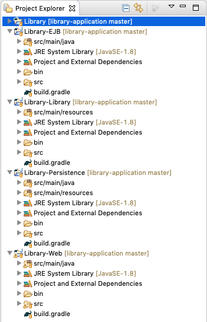
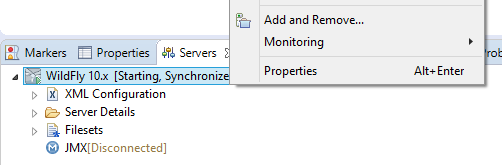

## Contents

1. [Preconditions](#precond)
1. [Importing the Example Application into Eclipse](#import)
1. [Creating an Enterprise Application from scratch](#create)

## <a id="precond" name="precond" />Preconditions
* Make sure **WildFly** and **Eclipse with JBoss Tools Plug-in** are properly **installed** and configured ([tutorial](010_setting_up_environment_with_docker.html)).
* **Start Eclipse** and make sure the **Java EE perspective** is opened.
* Make sure that a **WildFly 10 Runtime Server** is configured in Eclipse as outlined in the [first tutorial](010_setting_up_environment_with_docker.html).

## <a id="import" name="import" />Importing the Example Application into Eclipse
This tutorial will show how to import a Java EE application using the example of a library application. It allows you to quickly get started with Eclipse, Java EE and JBoss Tools. The next section, [Creating an Enterprise Application from scratch](#create), will show how you can create your own Java EE projects.

1. **Download** the [library application source files](https://github.com/wwu-pi/library-application/archive/master.zip) or **clone** the [library application project](https://github.com/wwu-pi/library-application/) to a temporary folder.
1. **Select** *File* > *Import...* from the Eclipse menu bar.
1. Choose *General* > *Existing Projects into Workspace* and click next.
1. Choose **"Select archive file"** and browse to the archive from step 1.
1. **Four projects** called Library, Library-EJB, Library-Persistence and Library-Web should appear under "Projects". Make sure all four are selected and **"Finish"**.
1. The project explorer should now contain the four projects. Eclipse will automatically validate and build the projects.

    

1. <a id="import-deploy" name="import-deploy" />In the "Servers" tab, **right-click** on your **WildFly 10 server** and select **"Add and Remove..."**.

    

1. Select the **library application** and click *Add >*, then "Finish. <small>Should Eclipse fail to display any applications, ensure that all EAR projects in the workspace contain an ``EarContent`` directory. In case the project was imported from VCS (e.g. git), an empty ``.gitkeep`` file within ``EarContent`` will ensure the directory is always present.</small>
1. **Start the server** and wait until the application has been deployed.
1. The Library web application is accessible under [http://localhost:8080/Library-Web/](http://localhost:8080/Library-Web/).

---

## <a id="create" name="create" />Creating an Enterprise Application from scratch
The following instructions show how to create an enterprise application from scratch, without importing existing projects. It may be helpful when you start developing your own application, for example during the practical course.

An enterprise application consists of several projects. In the following, the application is made up of four projects:

1. [**Enterprise Application Project**](#create-ear): a container project that packages the other projects into an ``.ear`` file for deployment purposes.
1. [**JPA Project**](#create-jpa): the data model of your application, contains mostly Entities.
1. [**EJB Project**](#create-ejb): the business logic of your application, contains mostly Session Beans.
1. [**Web Project**](#create-web): the web presentation layer of your application, implemented using JSF technology, contains web pages and Java classes as backing beans.

This tutorial uses "Test" and variations thereof as project names. Of course, you are free to choose your own names.

### <a id="create-ear" name="create-ear" />New Enterprise Application Project
1. Select *File* > *New* > *Enterprise Application Project* from the menu bar.
1. In the "New EAR Application Project" dialog, enter "Test"as **project name**, make sure that WildFly 10 is the target runtime and **click "Finish"**.

### <a id="create-jpa" name="create-jpa" />New JPA Project
1. Select *File* > *New* > *JPA Project* from the menu bar.
1. In the "New JPA Project" dialog, enter "Test-Persistence" as **project name**. Again, the target runtime should be WildFly 10. "Minimal Configuration" should be selected as "Configuration".
1. As we want this project to be part of the enterprise application, we **select "Add project to an EAR"** and **choose** our **Test project** from the **"EAR Project Name" menu**.
1. Click **"Finish"**. (Do **not** switch to the JPA perspective if asked to do so.)
1. **Open** the file **``persistence.xml``** (under "JPA Content" or under ``src/META-INF/``) and switch to the **"Source" tab**. **Modify** the **node** **``persistence-unit``** to match the following snippet:

        <persistence-unit name="Test-Persistence">
          <jta-data-source>java:/DefaultDS</jta-data-source>
          <properties>
            <property name="hibernate.hbm2ddl.auto"
              value="create-drop"/>
          </properties>
        </persistence-unit>

     This defines the data source to use ("java:/DefaultDS" is the JNDI address of the HSQL database you installed on WildFly) and ensures that you always start with a fresh database after deployment. When you've reached a stable data schema, you can use "validate" or "update" instead of "create-drop".

1. To create your first **Entity**, right-click on the project, select *New* > *JPA Entity* and follow the wizard (you may not use class names that coincide with SQL keywords such as "order". Moreover, member names may not contain special characters such as underscores).

### <a id="create-ejb" name="create-ejb" />New EJB Project
1. Select *File* > *New* > *EJB Project* from the menu bar.
1. In the "New EJB Project" dialog, enter&nbsp;"Test-EJB"as **project name**. The "EJB module version" should be set to 3.2.
1. As we want this project to be part of the enterprise application, we **select "Add project to an EAR"** and **choose** our **Test project** from the **"EAR Project Name" menu**.
1. After clicking **"Next" twice** we **disable** the **"Create an EJB Client Jar..."** check box. For the moment we do not need a separate EJB client jar file.
1. A click on **"Finish"** will create a new EJB project.
1. To create a **Session Bean**, right-click on the project, select *New* > *Session Bean (EJB 3.x)* and follow the wizard.

### <a id="create-web" name="create-web" />New Web Project
1. Select *File* > *New* > *Dynamic Web Project* from the menu bar.
1. In the "New Dynamic Web Project" dialog, enter "Test-Web"as **project name**. The "Dynamic web module version" should be set to 3.0.
1. Under **"Configuration"** click **"Modify"** and make sure that **"JavaServer Faces v2.2 Project"** is included in the Project Facets.
1. As we want this project to be part of the enterprise application, we **select "Add project to an EAR"** and **choose** our **Test project** from the **"EAR Project Name" menu**.
1. A **click on "Finish"** will create a new web project.
1. XHTML Pages with Facelets markup go into the ``WebContent`` folder (*New* > *Other...*). Backing beans should be created as Java classes under ``JavaResources/src``.

Please refer to [steps 7-9](#import-deploy) of the section "[Importing the Example Application into Eclipse](#import-deploy)" in order to learn how to deploy your project.
You might want to include a *welcome file list* in your web.xml.

    <welcome-file-list>
        <welcome-file>yourFirstPage.xhtml</welcome-file>
    </welcome-file-list>
