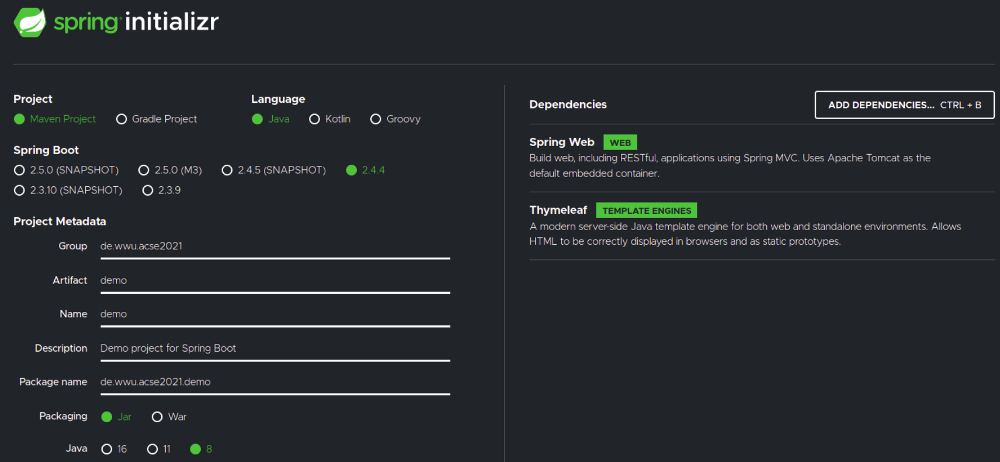
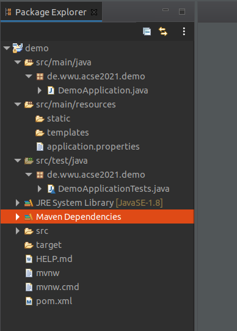
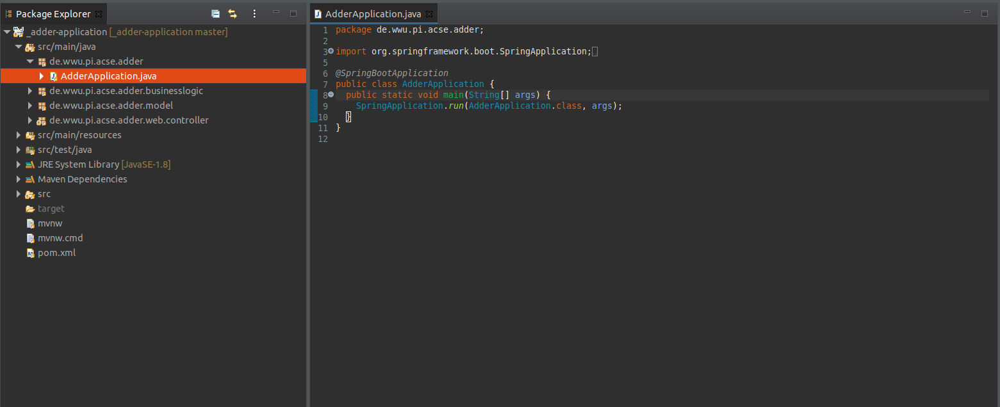
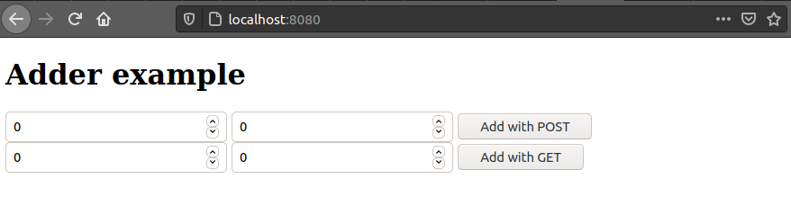
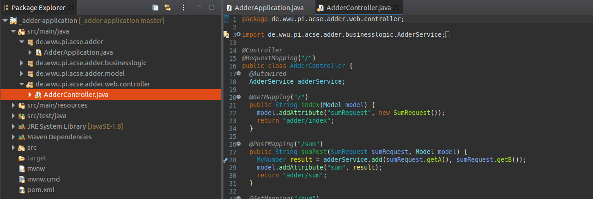
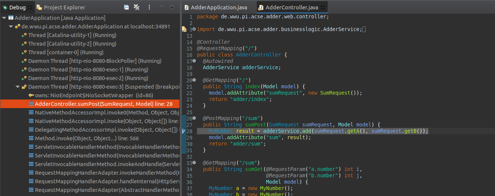
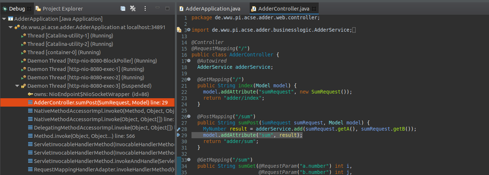

# Importing Sample Projects

This tutorial will demonstrate how to set up and execute the different sample projects. Note that there are multiple
ways you can proceed here.

## Contents
1. [Spring Initializr](#init)
1. [Run the Spring Boot Application](#run)
1. [MVC Adder Application](#mvc)
1. [SOAP and Rest Adder Projects](#sr)
1. [Statistics Example with MoM](#jms)
1. [Statistics Example with Kafka](#kafka)

## Spring Initializr
[Spring Initializr](https://start.spring.io/) makes it easy to set up new Spring Boot projects. Spring applications using
Spring Boot applications are preconfigured and, e.g., have classpath scanning enabled by default. 
Since initial projects will be provided for most tasks, it will often not be necessary to initialize a new 
project. Nevertheless, in the following, the simple set-up process is demonstrated.

#### Creating a new skeleton
In Spring Initializr we can create a skeleton which we can use to, e.g., build a new Web Application. 
For ACSE, we will let Spring Initializr generate a Maven Project using the language 'Java' version 17. However, this will be done for you and the project will be provided to you.
We will use the default Spring Boot version and choose 'Jar' for packaging.

On the right-hand side there is an option to configure the dependencies of the project. A pool of dependencies is shown,
some of which are Spring projects like Spring Web, Spring Data JPA, and Spring Security. Others are general dependencies 
like Thymeleaf or Lombok. The dependencies will be added to the pom.xml of the generated skeleton. Generating a new 
skeleton with the shown dependencies will create the pom.xml used in the 
[MVC Adder Application](https://github.com/wwu-pi/adder-application) (there might be some slight differences due to
different versions of Spring being used).

#### Importing the skeleton into Eclipse
1. Generating the template will automatically download a .zip. Extract the .zip-folder to a position of your liking.
1. Open Eclipse with a (new) workspace.
1. In Eclipse, select "Import projects..." > "Maven" > "Existing Maven Projects".
1. In the new window, browse for the folder you extracted and press open.
1. The pom.xml should be automatically detected. Press "Finish". The dependencies specified in the pom.xml will be
automatically resolved.

The resulting file structure should look similar to the one displayed below:

## Run the Spring Boot Application
You can start the appliation using the command line and Eclipse. Generally, you should start the application using the
command line. <b>Notice that changes to the application per default are not reflected by an already running application</b>
(see [Enabling live reload](#live)).

### Run the application using the command line
For running the application in the command line, open a console window and navigate to the folder where
the project is located. Projects created with Spring Intializr already contain the [Spring Boot Maven plugin](https://docs.spring.io/spring-boot/docs/current/maven-plugin/reference/htmlsingle/)
so you can simply execute <code>./mvnw spring-boot:run</code>. If you are lacking permissions to execute the 
application under Linux, you can try executing <code>chmod a+x <i>mvnw-file</i></code> and trying again thereafter.
Executing <code>./mvnw spring-boot:run</code> will take care of the different maven lifecycle steps and start the application.

### Run and debug the application using Eclipse
#### Run the application in Eclipses
Running the application from Eclipse can be useful to, e.g., debug the different steps of the application. To start
the application using Eclipse, find the class which has the <code>@SpringBootApplication</code> annotation. 
This class is automatically created using Spring Initializr. "In the class", right-click and either choose 
"Run As" > "Java Application" or "Debug As" > "Java Application" to run the application in debug mode. 

#### Debug the application in Eclipse
In the latter case you can set breakpoints in the application which, upon executing the logic, will halt the execution of the application and
enable you to step through the application. When hitting the first breakpoint, you will be prompted the dialog 
"Confirm Perspective Switch". Select "Switch".

For instance, we start the application using the <code>@SpringBootApplication</code> class of the [MVC Adder Application](#mvc)
in debug mode.

We load the application in a browser. The application here is accessible under <code>localhost:8080</code>. 

We set a breakpoint in the <code>sumPost(...)</code>-method of the controller class, next to the line 
<code>MyNumber result = ...</code>.

Once we hit the button "Add with POST", the <code>sumPost(...)</code> method is called and the execution is halted at
the corresponding line. 

Now, we can use the debugger to step through the application. For instance, after using "Step over (F6)", we now are at the line <code>model.addAtribute(...)</code>.

### Enabling live reload
To enable the automatic loading of code changes at run time, you can add the 
[Spring Boot DevTools](https://mvnrepository.com/artifact/org.springframework.boot/spring-boot-devtools/2.4.4) to your 
pom.xml. Saved changes should now be automatically loaded. When running the application in debug mode using this extension,
a <code>SilentExitException</code> is thrown. You should be able to simply run over this exception (F8) and ignore it. 
Code changes to a method which already is called will not be reflected. <b>This plugin should be disabled upon submission</b>. 
Also note that for each reload, session-information is lost.

## Spring MVC Adder Application
The [MVC Adder Application](https://github.com/wwu-pi/adder-application) is a small exemplary web application following
the MVC pattern. This section will explain how to import the application into Eclipse. For running the application, 
refer to [Run the Spring Boot Application](#run). The running web application can be accessed under <code>localhost:8080</code>.

#### Cloning and importing the project using the command line
If you want to use the command line to get the application, navigate to a folder where the application should be cloned to and type 
<code>git clone https://github.com/wwu-pi/adder-application </code>. 

You can already execute the project by running <code>./mvnw spring-boot:run</code> in the command line.

Now, open Eclipse with a new workspace. Click "Import projects..." > "Maven" > "Existing Maven Projects". Navigate
to the folder of the project to and click "Open". The pom.xml should be automatically detected, click "Finish".

#### Cloning and importing the project using the Eclipse Git integration
If you prefer using the Git integration for Eclipse, open a (new) workspace. Then, press 
"Import projects..." > "Git" > "Projects from Git" > "Next" > "Clone URI". In the "URI" field, enter https://github.com/wwu-pi/adder-application.
The "Host" and "Repository path" fields should be set automatically. Press "Next" and make sure that the master-branch is selected.
Once again, click "Next" and input the directory in which you want to store the application. 

You are offered multiple options to import the project. Choose "Import as general project", press "Next" and choose the 
location where the project should be stored. Then, click "Finish".

You can already execute the project by running <code>./mvnw spring-boot:run</code> in the command line. 

In the Eclipse IDE, right-click the imported project and click "Configure" > "Convert to Maven Project".

## Spring SOAP/REST Adder Application
The [SOAP](https://github.com/wwu-pi/soap-application) and [REST](https://github.com/wwu-pi/rest-application) repositories each comprise two subprojects.
The only difference is that in the first set of subprojects, SOAP is used while the latter uses and accepts REST requests. The REST application- and client-projects
contain manually written DTOs. In the SOAP application- and client-projects the data objects are generated from an XSD file that can be found
under `src/main/resources`.

For cloning the application you can proceed analogous to [MVC Adder Application](#mvc). For importing the project into 
Eclipse, some details differ. Note that if you immediately import the project into Eclipse, without starting the SOAP web service beforehand,
the <code>soap-client</code>-subproject
will indicate an error. This is ok. Refer to [Generating the SOAP Data Model](#soapgen) to resolve the error.

For running the web application refer to [Run the Spring Boot Application](#run) using the 
<code>@SpringBootApplication</code>-annotated class in the <code>soap</code> subproject. 

<b>Note that this project offers only one method which presents a GUI to the user.</b>

In the `{soap, rest}-client` subprojects, the client classes, `AdderSoapClient` and `AdderRestClient` are manually instantiated in a one-time main-method. 
If you use a client in an application, you should make use of <code>@Autowired</code> for the client classes. 

#### Importing the project into Eclipse after cloning via the command line
After cloning, again, open a new workspace. Click "Import project..." > "Maven" > "Existing Maven Projects". 
Select the overall project folder. Two different pom.xmls should be displayed. 
Make sure both are selected and press "Finish". Both programs should be imported adequately.

#### Cloning the project using the Eclipse Git integration and importing the project
Again, open a new workspace. Clone the project using the Eclipse Git integration as demonstrated for the [MVC Adder Application](#mvc). 
Again, choose "Import as general project" > "Next" > "Finish". Now, right-click the project and select "Configure" > "Configure and Detect Nested Projects".
Two subprojects should be detected. Click "Finish".

#### Generating the SOAP Data Model
The error in the <code>soap-client</code>-subproject is the result of the plugin used in the pom.xml. The
plugin tries to retrieve the WSDL-file from the server to generate the data model specified in XSD. However, since the local 
server which provides the WSDL has not yet been started, the request cannot be fulfilled. 
After starting the <code>soap</code>-subproject (see [Run the Spring Boot Application](#run)) you can build and run 
the <code>soap-client</code>-subproject. During the maven lifecycle, the sources are generated.
After starting the SOAP application, you can also right-click the `soap-client` project and select "Maven" > "Update Project" to get rid of this error.

A particularity of the project is that no own data transfer objects are used for the REST-part of the application. 
Instead, the SOAP-generated classes are reused. For your REST project you do not have to specify an XSD. Rather, you should
directly define your classes. 

## Spring Statistics Example with Message-Oriented Middleware
The [Statistics Example with MoM](https://github.com/wwu-pi/acse-statistics-with-mom) demonstrates the use of message-oriented 
middleware in Spring. The suggested way of running the application requires a docker container which runs the message broker.
Run <code>docker run -e AMQ_USER=admin -e AMQ_PASSWORD=admin -e AMQ_SECURITY_ENABLED=false -p8161:8161 -p61616:61616 --name artemis quay.io/artemiscloud/activemq-artemis-broker</code> in the console to pull and run the docker container prior to starting
the application. 

For the setup, proceed analogously to [SOAP and Rest Adder Projects](#sr). Different from [SOAP and Rest Adder Projects](#sr),
the client here is an own web application. It can be accessed under <code>localhost:8080</code>.

## Spring Statistics Example with Kafka
The [Statistics Example with Kafka](https://github.com/wwu-pi/acse-statistics-with-kafka) demonstrates the use of Kafka in Spring. 
The suggested way of running the application is via the console. For this, navigate to the root project folder where `docker-compose.yml` is located. 
There, execute `docker-compose up -d`. This will start the Kafka broker and Zookeeper. 
Afterwards, you can stop the started docker containers via `docker-compose down`.

For the setup, proceed analogously to [SOAP and Rest Adder Projects](#sr). Different from [SOAP and Rest Adder Projects](#sr),
the client here is an own web application. It can be accessed under <code>localhost:8080</code>.
