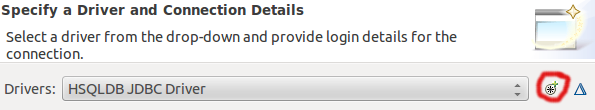

## Preconditions
  * Make sure **Eclipse with JBoss Tools Plug-in** is **installed** properly ([tutorial](010_setting_up_environment_with_docker.html)).
  * **HSQLDB's connection string** should include **``shutdown=true``** on **WildFly** to ensure the database is closed correctly. This is needed to overcome the limitation of [*in-process* HSQLDBs](http://www.hsqldb.org/doc/guide/running-chapt.html#rgc_inprocess) supporting just one, its creating, thread.
  * Alternatively (No need to stop WildFly server): Start [HSQLDB as a dedicated instance](http://www.hsqldb.org/doc/guide/running-chapt.html#rgc_hsql_server) and [change JDBC connection strings accordingly](http://www.hsqldb.org/doc/guide/running-chapt.html#rgc_connecting_db).

## Creating a Database Connection for *In-Process* HSQLDB
  1. Open the **"Data Source Explorer" view** using *Window* > *Show view* > *Other* and create a **new Database Connection**.
  1. Choose **HSQLDB** from the list of **Connection Profile Types** and provide a name, e.g. Library.
  1. Next, add a **New Driver Definition** and specify **hsqldb.jar** in the **JAR List** tab.

     

  1. Enter the **database name** and specify the **location of the database files, e.g. ``file:/tmp/wildfly/standalone/data/hypersonic/localDB``.**

## Creating a Database Connection for *Dedicated* HSQLDB
  1. Start a *dedicated* instance by *executing* the following *on a shell*: ``java -cp ~/Downloads/hsqldb.jar org.hsqldb.server.Server --database.0 file:localDB --dbname.0 localDB``
   * Adjust Java's classpath (``-cp``) to match the location of ``hsqldb.jar`` on your system
   * ``database.0``: the location where the database is stored
   * ``dbname.0``: remote name/**database name** for the database
  1. Perform steps 1-3 of *In-Process* HSQLDB (they also apply when using a *dedicated* HSQLDB).
  1. Enter the the **database name** and specify the **address/location of HSQLDB, e.g. ``hsql://localhost/localDB``**.

For the *dedicated* HSQLDB instance to be used by deployed applications, you need to **adjust the corresponding datasource** to connect to it. Go to the Wildfly Console and change the **Connection URL** to ``jdbc:hsqldb:hsql://localhost/localDB``, so that it matches your previously defined **database name**.

## Accessing HSQLDB

### HSQLDB Database Manager
  1. *Execute* the following *on a shell*: ``java -cp path-to-your-hsqldb/hsqldb.jar org.hsqldb.util.DatabaseManagerSwing``
  1. *Connect* to the HSQLDB server.
   * Type: **HSQL Database Engine Server**
   * Driver: **org.hsqldb.jdbcDriver**
   * URL: **jdbc:hsqldb:hsql://localhost/localDB** (adjust to match your database name)
   * User: **sa**
  1. Perform queries on HSQLDB.

### SQL Scrapbook
  1. *In-Process* HSQLDB only: **Stop WildFly** to shutdown HSQLDB.
  1. **Right-click** on connection and select **"Connect"**.
  1. **Right-click** on connection and select **"Open SQL Scrapbook"**.
  1. Perform queries on HSQLDB.
  1. *In-Process* HSQLDB only: **Right-click** on connection and select **"Disconnect"**, **before starting WildFly again**.
