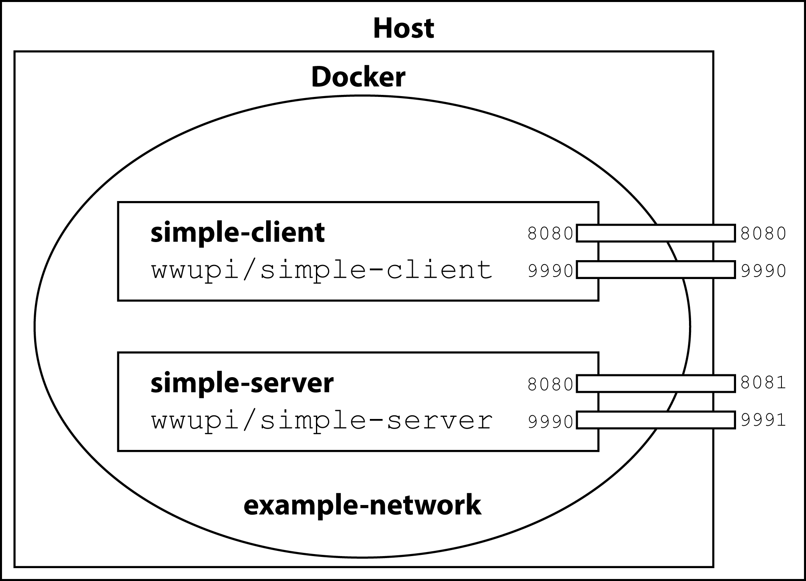

## Contents

1. [Quickstart](#qickstart)
1. [What just happened?](#what)

## <a id="qickstart" name="qickstart"></a>Quickstart

1. Make sure **Docker** and **Docker Compose** are properly **installed**  ([tutorial](010_setting_up_environment_with_docker.html)) and you know your Docker IP (typically `localhost`; when using Docker Toolbox, run  `docker-machine ip` on your command line).
1. Copy the [example applications](https://wiwi-gitlab.uni-muenster.de/pi-examples/acse-docker-simple-service) to your projects folder, e.g. with
```
git clone https://wiwi-gitlab.uni-muenster.de/pi-examples/acse-docker-simple-service.git
cd acse-docker-simple-service
```
1. Use Docker Compose to build the Docker images by running
```
docker-compose build
```
1. Use Docker Compose to run the example microservices
```
docker-compose up
```
1. In your browser navigate to `http://DockerIP:8080/SimpleClient/` to access the user interface of the `SimpleClient` microservice and `http://DockerIP:8081/SimpleServer/?first=41&second=1` for the REST API of the `SimpleServer` service.

## <a id="what" name="what"></a>What just happened?

The microservice example application consists of the `SimpleClient` that presents users with an HTML page for adding two integer values. For this task, it relies on the `SimpleServer` service that provides the implementation. Both services run in separate containers and Wildfly instances and communicate only via REST API calls.

To manage the two services, we use Docker Compose. The [`docker-compose.yml` file](https://docs.docker.com/compose/compose-file/) at the root folder of the project contains the necessary description. It specifies the build contexts (the folders `SimpleClient` and `SimpleServer`) as well as the name of the two Docker images. The `docker-compose build` command uses this information to initiate a build of the images.

Docker images are build by following the steps of a [`Dockerfile`](https://docs.docker.com/engine/reference/builder/) that is part of the build context. This example uses a similar `Dockerfile` for both services (see e.g. `SimpleClient/Dockerfile`). In this case, the image build process is separated into two stages: the compilation of the Java service into a WAR archive and the final assembly info a Wildfly environment.

Each stage starts with a `FROM` directive that determines the starting point, i.e. a Docker image that already exists and that should be extended. The compilation stage is based on the `gradle:4.6-jdk8-alpine` image, which is downloaded from the Docker Hub registry if it does not exist locally. This image contains the Java 8 JDK as well as [Gradle](https://gradle.org/), a build tool that automates the compilation. The next steps, `COPY` and `RUN`, add the Java code from the build context into the image and instrument Gradle to build the WAR archive.

Docker images are organized into layers, where each layer contains a set of changes. Together they form the file system for the container. In general, each directive of the `Dockerfile` creates a new layer. As a consequence, removing intermediary files only marks them as deleted in the new layer and does not actually removes them from the layers before. Docker hence [gives the advice](https://docs.docker.com/develop/develop-images/dockerfile_best-practices/) to either remove intermediary files in the same step or use multiple stages.

To run the microservices, only the WAR file is necessay. We therefor start a new stage with a new `FROM` directive, which starts from the existing image `jboss/wildfly:12.0.0.Final`. This image contains an installation of Wildfly so the only required step is to copy the WAR file from the last stage into this one. The next directives add an admin user (`RUN`), specify that the ports 8080 and 9990 are exposed (`EXPOSE`) and set the default command that is executed when a new container is started (`CMD`).

With that the images `wwupi/simple-client` and `wwupi/simple-server` are available locally, and, when you executed `docker-compose up`, two new containers were instantiated from those images. Docker places these containers in a new virtual network and gives each container a separate IP address. To access the services, the ports have to be published. Here a mapping of `8081:8080` means that packages for `DockerIP:8081` are routed to port `8080` of that container. Docker further provides a DNS server within the virtual network. Because Docker assigns the IP addresses randomly, the containers need a way to find each other. The internal DNS server provides that by resolving the name of the container to its IP address. The `SimpleClient` can hence communicate with the `SimpleServer` via `http://simple-server:8080`.


