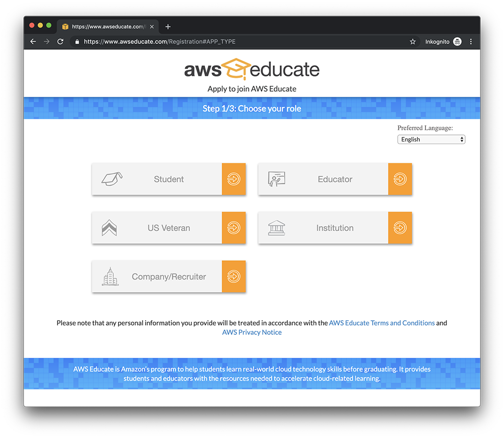
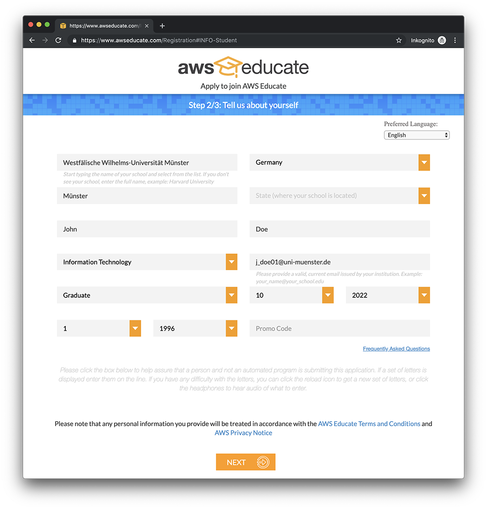
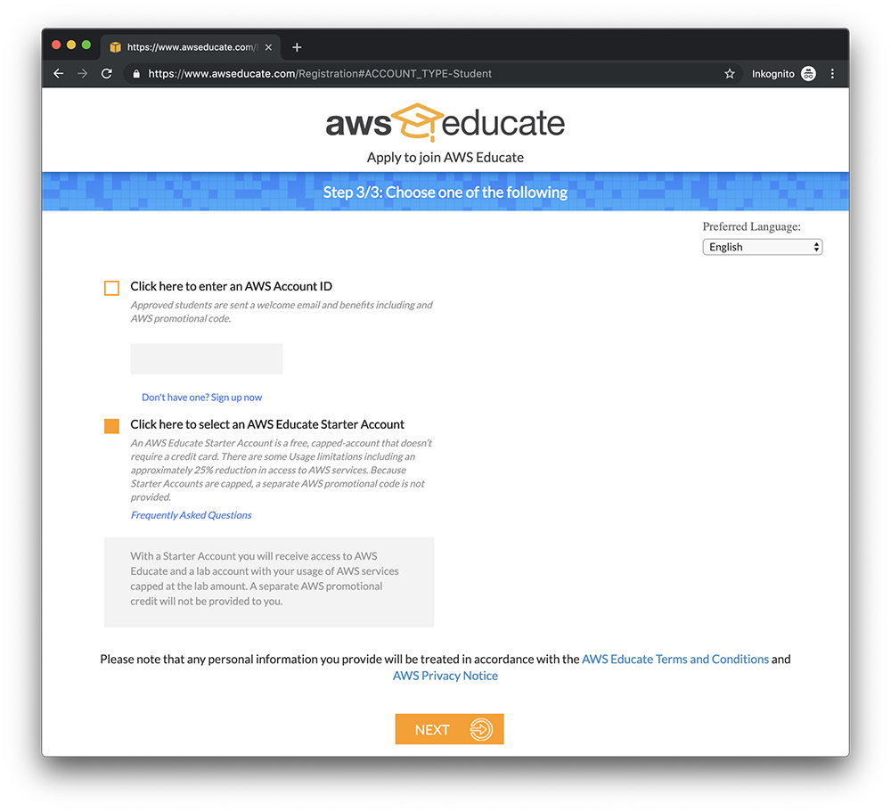
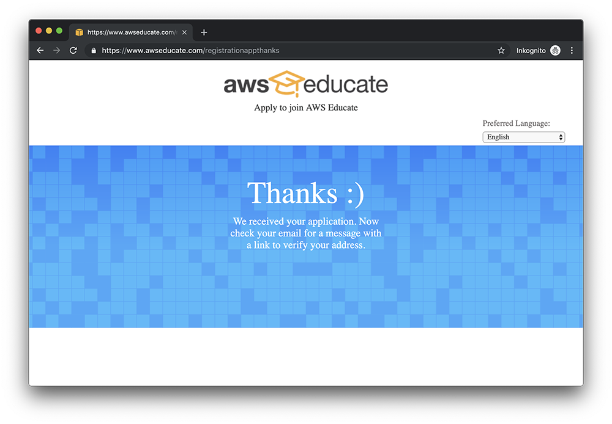
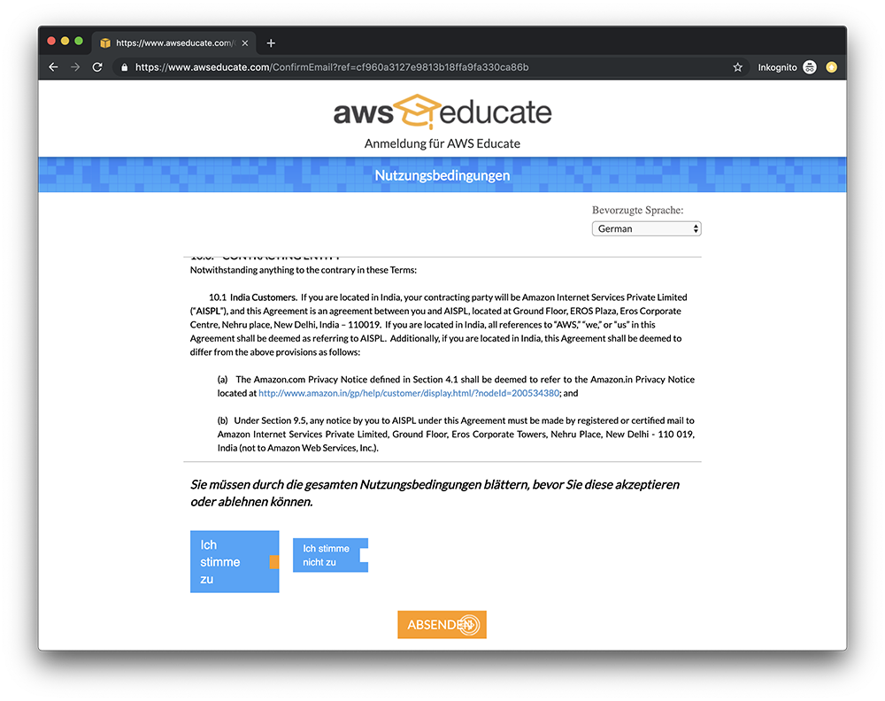
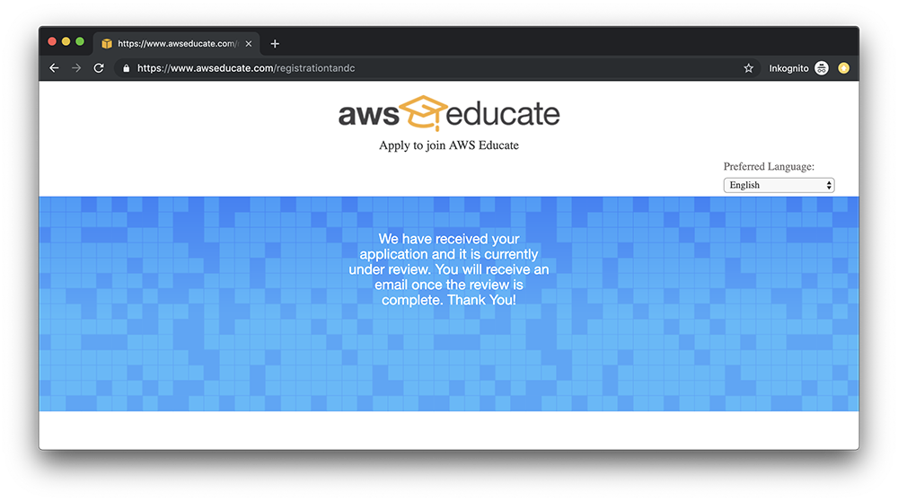

The Amazon Web Services (AWS) public cloud offers a variety of cloud services. To get familiar with cloud products students have to solve an exercise as part of the ACSE lecture.

## Contents

1. [Register](#register)

## Register

AWS offers students free credit of 75 or 100 USD. The registration process could take a couple of days. We therefore advise you to apply in due time before the exercise begins. The credit is not tight to the ACSE lecture so make sure that one member of your group has enough credit to complete the exercise.

To start the registration process, navigate to the [AWS Educate](https://www.awseducate.com/registration) page.

Choose student to register as a student.

Fill out your personal information. Make sure to specify `Westfälische Wilhelms-Universität Münster` as institution name and `<ziv_id>@uni-muenster.de` as email.

You have to choose between connecting your application to an existing AWS account or creating a AWS Educate Starter account. Full AWS accounts will receive more credit, but require a credit card. We recommend choosing AWS Educate Starter account to prevent unexpected expenses!

After completing the form an email will be send to you to confirm the registration.

Read the terms of use.

When you accept the terms of use the application is complete and you should receive an approval after a couple of days.

Follow the instruction in the email to set your password. After that, you can [sign into your AWS Educate Starter account](https://www.awseducate.com/signin). From there you can access the AWS console by clicking on "AWS Account" > "AWS Educate Starter Account" > "AWS Console".

With the AWS Educate Starter Account you are limited to the US East (North Virginia) region (`us-east-1`).
