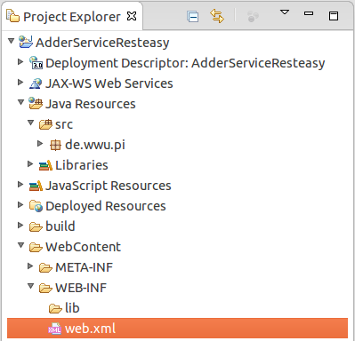

### Example project

This tutorial will show how to import a Java EE RESTEasy application using the example of a simple adder application. It allows you to quickly get started with Eclipse and RESTEasy.

1. Download the [adder service application source files](https://github.com/wwu-pi/resteasy-example/archive/master.zip) ([Project on GitHub](https://github.com/wwu-pi/resteasy-example)) to a temporary folder.
1. Import the archive as described in the [basic Java EE tutorial](tutorial_jboss_project.html#import). 
1. Once you published your projects onto your application server and started the server, your adder service is accessible under <a href="http://localhost:8080/AdderServiceResteasy/api/">http://localhost:8080/AdderServiceResteasy/api/</a>.
1. Try changing parts of the URI, i.e. <a href="http://localhost:8080/AdderServiceResteasy/api/add/1/3/">.../api/add/1/3/</a>. Also try to send different Accept-Header using a [curl](http://curl.haxx.se/)-like tool such as [httpie](https://github.com/jkbr/httpie), [REST Console for Chrome](https://chrome.google.com/webstore/detail/rest-console/cokgbflfommojglbmbpenpphppikmonn), or [RESTClient for Firefox](https://addons.mozilla.org/firefox/addon/restclient/) to see how the resource responds with different representations.
1. Also try the <a href="http://localhost:8080/AdderClientResteasy/index.xhtml">sample client</a> that uses the RESTEasy web service.

### Enabling RESTEasy
Using a dynamic web project, add the following to your `WEB-INF/web.xml` in order to let RESTEasy discover your resources:

```
  <servlet-mapping>
      <servlet-name>javax.ws.rs.core.Application</servlet-name>
      <url-pattern>/api/*</url-pattern>
  </servlet-mapping>
```
