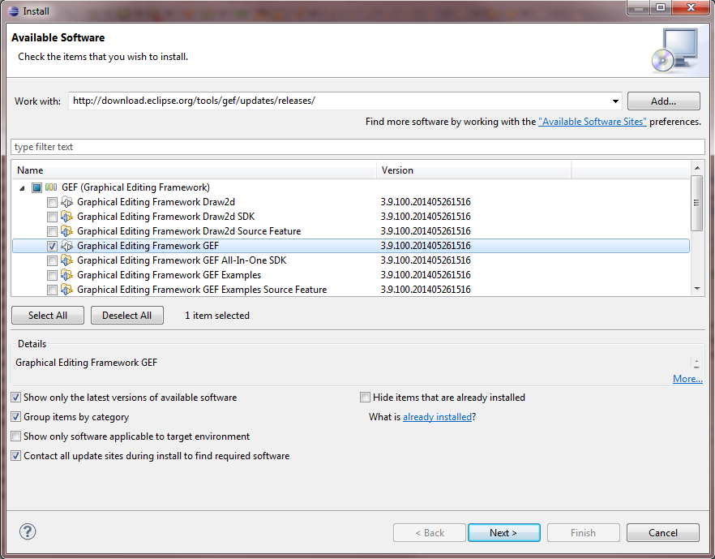
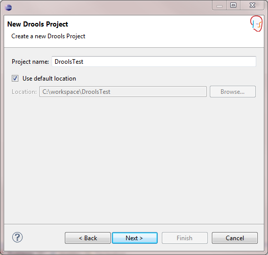
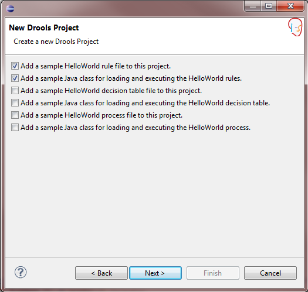
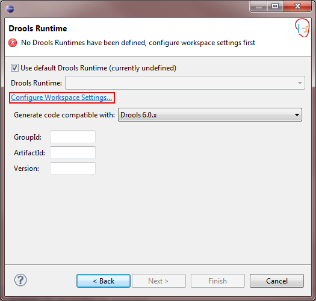
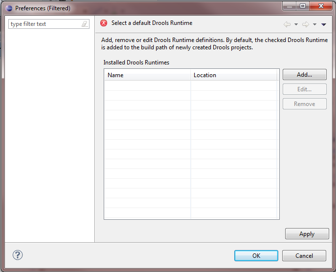
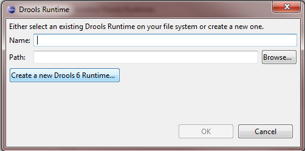
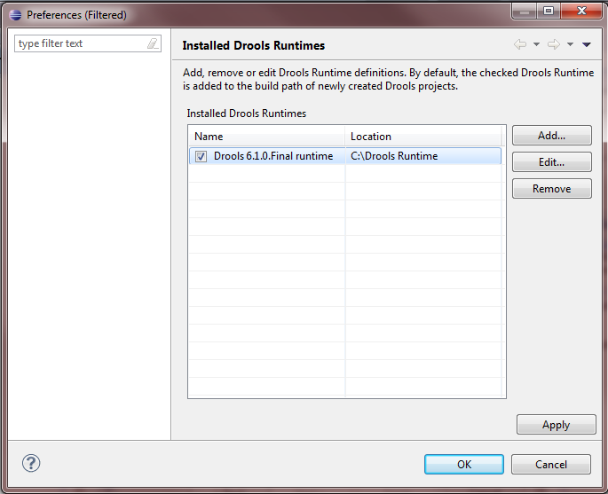
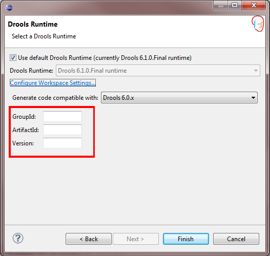

**Windows, Mac and Linux (Ubuntu):**

1. [Download](https://www.eclipse.org/downloads/) and install Eclipse IDE.

2. Install the GEF Plugin for Eclipse:

   * Run Eclipse IDE.

   * Select **Help** > **Install New Software...**.
   
   * In the **Work with:** combo box type: http://download.eclipse.org/tools/gef/updates/releases/
   
   * Select "Graphical Editing Framework GEF".
   
   
3. Install Drools:
   * Select **Help** > **Install New Software...**.
   
   * In the **Work with:** combo box type: http://download.jboss.org/drools/release/6.4.0.Final/org.drools.updatesite/
   
   * Select all.
   
   
   * Make sure the checkbox "Contact all update sites during install to find required software" is checked.

4. Create Drools Runtime:
   * In Eclipse switch to the **Drools perspective** (upper right corner).
   
   * Select **File** > **New** > **Drools project**.
   
   * Choose a name and click "Next".
   
   
   * Click "Next".
   
   
   * Click "Configure Workspace Settings...".
   
   
   * Click "Add...".
   
   
   * Click "Create a new Drools 6 Runtime..." and choose a directory to create the Drools Runtime.
   
   
   * Select the created Drools Runtime and click "OK".
   
   
   * Enter a `GroupId`, an `ArtifactId`, and a `Version` for your project. You may choose arbitrary non-empty values. Afterwards, click "Finish" to create the project.
   

   * Open the class that contains the main method. It is located in the package `com.sample` and has the same name as the project.
   
   * In order to execute the project, right-click the editor and select **Debug As** > **Drools Application**. Observe the output. You can ignore the SLF4J warnings.

