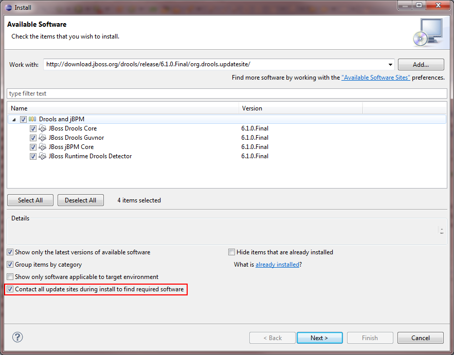

**Windows, Mac and Linux (Ubuntu):**

1. [Download](https://www.eclipse.org/downloads/) and install Eclipse IDE.

2. Install the GEF Plugin for Eclipse:

   * Run Eclipse IDE.

   * Select **Help** > **Install New Software...**.
   
   * In the **Work with:** combo box type: http://download.eclipse.org/tools/gef/updates/releases/
   
   * Select "Graphical Editing Framework GEF".
   
   
3. Install Drools:
   * Select **Help** > **Install New Software...**.
   
   * In the **Work with:** combo box type: http://download.jboss.org/drools/release/6.1.0.Final/org.drools.updatesite/
   
   * Select all.
   
   
   * Make sure the checkbox "Contact all update sites during install to find required software" is checked.

